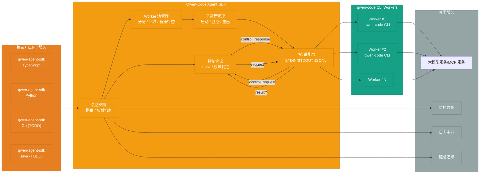
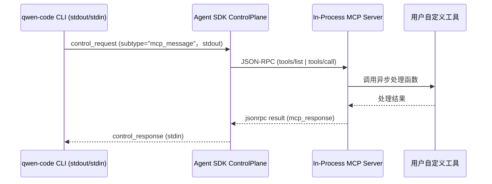

# Qwen-Code Agent 框架架构设计（整理版）

## 概览

| 字段 | 详情 |
| --- | --- |
| 设计版本 | v1.1 |
| 最后更新 | 2025-10-10 |
| 架构范围 | Qwen-Code Agent SDK 与 qwen-code CLI 的子进程编排、控制协议、可观测与配置体系 |
| 关键目标 | 为第三方应用提供统一 IPC 通信、Worker 池治理、权限控制与工具桥接能力 |

- **核心组件**: 文档聚焦 Qwen-Code Agent SDK, 在宿主进程内封装会话路由、控制协议与 Worker 池治理, 面向多语言场景提供统一接入。
- **核心职能**: 会话调度与路由；CLI 子进程生命周期与资源治理；控制协议 Hook 与权限判定；轻量日志输出与可观测接入；观察性数据采集（日志、指标、追踪）。
- **核心功能**: 支持同步/异步任务执行、流式输出、会话管理、错误处理与重试、In-Process MCP 工具桥接以及独立配置注入。
- 面向多语言 SDK，统一封装 CLI 子进程生命周期与 JSONL 协议。
- 提供会话调度、权限治理、Hook/MCP 回调、日志与指标采集的一致接口。
- 以与 Claude Agent SDK 对齐的协议规范，降低多端协作与生态集成成本。

## 架构总览

| 层级 | 主要组件 | 职责要点 |
| --- | --- | --- |
| 上游客户端 | TypeScript / Python / Go / Java SDK | 暴露标准 API，适配各语言生态，负责会话接入与自定义工具注册 |
| Agent SDK 内核 | Router、ControlPlane、WorkerPool、ProcessMgr、IPC | 管理会话路由、权限回调、进程池生命周期与 STDIO JSONL 传输 |
| CLI Worker | qwen-code CLI 子进程 | 执行模型推理与工具调用，按照协议输出 `chat.completion*` / `result/*` / `control_request` |
| 周边服务 | LLM/MCP、监控、日志、追踪 | 提供模型服务、可观测数据与外部系统集成能力 |



- Agent SDK 与 CLI 共享 STDIN/STDOUT 双向 JSONL 通道，统一传输 `chat.completion*`、`result/*`、`control_request` 等事件。
- 双向通信链路：CLI 逐行输出 `chat.completion`/`result/*`/`control_request` 至 stdout，SDK 解析后按需通过 stdin 回写 `request`/`control_response`，当出现 `control_request{subtype:"mcp_message"}` 时，ControlPlane 会将 JSON-RPC 转发至本地 MCP Server 并回传 `mcp_response`。
- qwen-code CLI 已接入 OpenTelemetry，上报模型调用、工具执行、CLI 内部事件；Agent SDK 需独立接入，并通过 Trace/Span ID 串联端到端链路，构建统一排障视角。
- 控制协议的事件语义与 CLI 输出格式规范保持一致，详见配套的 `stream-json` RFC。
- 事件分类提示：关于 `result/*`、`request`、`control_request` 等事件的详细语义，请参阅《qwen-code-cli-output-format-stream-json-rfc_cn.md》的“事件机制分类”章节。

## 核心能力映射

| 能力域 | 关键内容 | 当前能力 | 后续演进 |
| --- | --- | --- | --- |
| 会话调度 | 会话路由、Worker 绑定、复用策略 | SDK 侧提供 Router、Worker 池调度 | 增强会话分支/子代理调度 |
| 进程治理 | 子进程启动、监控、重启 | ProcessMgr 负责生命周期与资源限制 | 引入资源配额、故障自动隔离 |
| 控制协议 | 权限回调、Hook、MCP | ControlPlane 统一处理 `control_request` | 扩展更多 Hook 点与审批策略 |
| IPC 协议 | JSON Lines、输入输出格式 | IPC 层实现 `stream-json`/`stream-chunk-json` | 丰富事件类型、协议版本协商 |
| 可观测性 | 日志、指标、Trace | SDK 与 CLI 各自接入 OTel，并输出结构化日志 | 统一指标命名与跨组件追踪分析 |

- 会话调度与控制层需要保证 Worker 独占机制、会话隔离与资源回收。
- 控制协议以 request/response 模型运行，SDK 必须在超时前回写 `control_response`，确保 CLI 不被阻塞。

## SDK 实现概览

| 语言 | 运行时要求 | 分发形态 | 关键依赖 | 主要能力 | 状态 |
| --- | --- | --- | --- | --- | --- |
| Python | Python 3.10+ | `pyproject + hatchling`，命名空间 `qwen_agent_sdk`，发布 `py.typed` | `anyio>=4`、`typing_extensions`、`mcp>=0.1`、`pydantic>=2` | `query()` 快速入口、`QwenSDKClient`、工具注册、权限/Hook 回调、日志与 OTel | 首发实现 |
| TypeScript | Node.js 18+ | 包 `@qwen-agent/sdk`，ESM 默认导出，`tsup` 产物 | `@qwen-code/cli`、`zx/execa`、`eventemitter3` | `createAgentManager`、流式迭代、权限回调、MCP 工具、settingSources 控制 | 首发实现 |
| Go | 待定 | 待定 | 待定 | 复用控制协议，暴露通用 API | TODO |
| Java | 待定 | 待定 | 待定 | 面向企业场景的 SDK | TODO |

### Python SDK 细节

- **运行时与分发**: 需 Python 3.10+；采用 `pyproject.toml + hatchling` 发布；提供 `qwen_agent_sdk` 命名空间与 `py.typed`。
- **环境依赖**: 需预装 Node.js 及 `qwen-code` CLI，SDK 启动前通过 `which qwen` 或 `QWEN_BIN` 环境变量定位二进制。
- **核心依赖**: `anyio>=4`、`typing_extensions`、`mcp>=0.1`、`pydantic>=2`。
- **适用场景**：第三方后端服务、希望自定义交互体验或进行服务端调用的场景。
- **API 设计**：
  - `async def query(...) -> AsyncIterator[Message]`：对齐 Anthropic `query()` 的流式接口。
  - `class QwenSDKClient`：支持 `async with`、会话续写与中断管理。
  - `QwenAgentOptions`：包含 `system_prompt`、`setting_sources`、`permission_mode`、`cwd`、`fork_session` 等参数。
  - `@tool` 装饰器 + `create_sdk_mcp_server`：将 Python 函数注册为 MCP 工具。
- **实现要点**：
  - `StdIOSubprocessTransport` 启动 `qwen` CLI，写入 JSONL，读取流式 chunk。
  - `_handle_control_request()` 对 `can_use_tool`、`hook_callback`、`mcp_message` 等 `subtype` 执行回调，并写入 `control_response`。
  - `Query.initialize()` 首次发送 `control_request{subtype:"initialize"}`，同步 Hook 配置与能力声明。
  - 支持 `PermissionResult`、Hook JSON 与 MCP JSON-RPC 的统一封装。
- **日志与可观测**：
  - 默认输出结构化 JSON 日志，支持 `structlog` 注入。
  - 可通过 `options.stderr` 捕获 CLI 原始错误流。
  - 规划内置 OpenTelemetry Tracer/Meter，记录会话耗时、传输错误、Worker 利用率。
- **健壮性**：
  - CLI 崩溃时自动重试与会话 fork，保存最近成功结果实现断点续传。
  - 回调异常时返回 `control_response{subtype:"error"}`，触发 CLI 安全回退。
- **测试体系**：
  - `pytest + pytest-asyncio` 覆盖核心流程。
  - `ruff + mypy` 保证代码质量。
  - 示例：`examples/quickstart.py`、`examples/mcp_calculator.py` 展示流式消费、权限回调与工具注册。

### TypeScript SDK 细节

- **运行时与分发**: 需 Node.js 18+；包名 `@qwen-agent/sdk`，默认 ESM 导出并通过 `exports` 暴露 CJS；使用 `tsup` 生成 `dist/esm`、`dist/cjs`、`dist/types`。
- **核心依赖**: `@qwen-code/cli`（peerDependency）、`zx/execa`、`eventemitter3`。
- **API 能力**：
  - `createAgentManager(options)`：提供 `createSession`、`run`、`forkSession`。
  - `session.stream(task)`：返回 `AsyncIterable<AgentMessage>`，可 `for await` 消费。
  - `onPermissionRequest`：以 `allow/deny/ask` + 规则返回权限决策。
  - `settingSources`：默认关闭，需要显式声明 `["user","project","local"]` 等条目才会加载对应设置文件。
  - `defineTools`：注册 MCP 工具，与 CLI 会话共享上下文。
  - `agents` 选项：支持内联多代理拓扑，结合 `forkSession` 构建子代理。
- **实现要点**：
  - 使用 `execa` 启动 CLI，统一解析 stdout 为 `AgentStreamChunk`。
  - `ProcessTransport` 逐行解码 stdout (`JSON.parse`)，通过 `EventEmitter` 推送 `control_request`、`result/*`、`chat.completion*` 事件，所有反向 `control_response` 共用子进程 stdin。
  - 维持 `result/heartbeat` 定时器，超时自动重启 Worker。
  - `pendingControl` 映射配合 `request_id` 路由 `control_request`。
  - 回调 Promise 生成标准化 `control_response` payload；未注册时走默认策略。
  - `onPermissionRequest`、`onHookEvent` 等回调 Promise 化处理，统一生成 `control_response`，未注册时沿用默认策略避免 CLI 阻塞。
  - `defineTools()` 将 TS 函数组装为 in-process MCP server，透传 JSON-RPC。
  - 初始化阶段等待 CLI 首条 `chat.completion` 握手信息，并通过 `control_request{subtype:"initialize"}` 发送 Hook/工具能力。
  - 异常场景记录 verbose 日志并返回 `control_response{subtype:"error"}`。
- **工程体系**：
  - `tsup` 产出 `dist/esm`、`dist/cjs` 与 `dist/types`。
  - 测试矩阵使用 `vitest` + `tsx`，结合 CLI mock 校验流式输出、权限回调。
  - 提供 `enableVerboseLogging()` 开关、`logger`/`stderr` 回调以及 OpenTelemetry Trace 规划。

### 其它语言路线（TODO）

- **Go/Java**：计划复用统一控制协议与 Worker 调度策略，面向企业场景与后端服务。
- 将在 Python/TypeScript 稳定后补充 SDK 设计与实现细节。

## 控制协议与 MCP 集成

| 通道 | 发起方 | 典型事件 | 回执要求 | 目的 |
| --- | --- | --- | --- | --- |
| `chat.completion*` | CLI → SDK | 模型回复、工具调用、收尾摘要 | 无需回执 | 承载主流程消息 |
| `result/*` | CLI → SDK | `result/command`、`result/heartbeat`、`result/cancel`、`x-qwen-session-event` | 无需回执 | 发布状态与辅助信息 |
| `*request` | SDK → CLI | `command_hint_request`、`heartbeat_request`、`control/cancel` | CLI 以 `result/*` 响应 | 触发即时操作 |
| `control_request` | CLI → SDK | `can_use_tool`、`hook_callback`、`mcp_message` | 需回写 `control_response` | 执行权限判定、Hook、MCP 调用 |

- 所有控制事件通过统一 STDIN/STDOUT 管道传输，SDK 必须确保在约定超时内响应。
- MCP 集成在 SDK 进程内创建 server，无需额外子进程或网络服务。
- 授权回调与 MCP 调用解耦：CLI 仍负责触发 `can_use_tool`，SDK 收到后执行权限逻辑，随后才能处理 `mcp_message`。



- 初始化阶段通过 `control_request{subtype:"initialize"}` 同步 Hook 配置与能力声明。
- 回调异常时，SDK 需记录日志并返回 `control_response{subtype:"error"}`，CLI 遵循安全回退策略。

## 通信模式与 MCP 能力

| 模块 | 形态 | 关键说明 |
| --- | --- | --- |
| IPC 模式 | STDIN/STDOUT JSON Lines | SDK 启动本地 `qwen` 子进程，以 JSON Lines 进行通信；协议细节对齐《qwen-code-cli-output-format-stream-json-rfc_cn.md》，保持 `/`、`@`、`?` 指令的即时回执。 |
| In-Process MCP Server | SDK 内嵌 MCP Server | 依赖 `mcp>=0.1` 在宿主进程创建 MCP Server，透传 `@tool`/`defineTools` 定义的函数，无需额外子进程或网络服务。 |

- **IPC 实现要点**：
  - `SubprocessCLITransport`（或等价实现）通过同一 STDIN/STDOUT 管道处理正向/反向消息，无需额外套接字。
  - CLI 输出 `chat.completion`/`chat.completion.chunk` 时需在首条消息的 `metadata` 携带 `protocol_version`、`input_format`、`output_format`、`capabilities`。
  - 事件语义覆盖 `result/heartbeat`、`result/cancel`、`x-qwen-session-event`、`control_request/control_response`，并提供 OpenAI 风格错误对象。
- **MCP 事件链路**：
  - CLI 通过 `control_request{subtype:"mcp_message"}` 将 JSON-RPC 请求写入 stdout，SDK 转发给本地 MCP Server 执行 `tools/list`、`tools/call`。
  - 执行结果封装为 `control_response` 写回 stdin，形成闭环。
- **授权分工与优势**：
  - CLI 触发 `control_request{subtype:"can_use_tool"}` 由 SDK 决策授权，MCP 调用链路与权限判定解耦。
  - 工具执行下沉到 SDK 进程内，降低延迟；Hook 能力可沿同一通路后续接入，与 Claude Agent SDK 实践保持一致。

## Worker 池与复用

| 维度 | 设计要点 | 实施状态 |
| --- | --- | --- |
| 状态机 | 空闲 → 占用 → 空闲，单 Worker 独占会话 | 已设计 |
| 复用策略 | 会话结束不销毁进程，清理上下文后复用 | 规划落地 |
| 安全保障 | 会话隔离、资源清理、健康检查 | 随 Worker 池实现同步 |
| 配置项 | `min_workers`、`max_workers`、`idle_timeout`、`max_sessions_per_worker`、`health_check_interval` | 需在 SDK/CLI 配置中暴露 |
| 可观测 | 结构化日志、指标导出、Trace 链接 | SDK/CLI 各自接入 |

- **环境说明**: Worker 本质是 qwen-code CLI 子进程，其容器/沙箱与工具桥接由 CLI 管理，SDK 仅通过 STDIN/STDOUT 进行调度与控制。
- Worker 仅在单会话期间占用，保证隔离；会话结束后回到空闲池。
- 复用依赖清理会话变量、关闭文件句柄、重置环境变量。
- 健康检查覆盖内存泄漏、僵尸进程、卡死检测，异常时自动重启。
- 典型配置示例：

```yaml
worker_pool:
  min_workers: 5
  max_workers: 50
  idle_timeout: 1800  # 30 分钟
  max_sessions_per_worker: 100
  health_check_interval: 60
```

- 会话日志需记录 `session_id`、`prompt_id`、耗时、命令摘要，支持回传至集中式日志系统。
- 指标采集聚焦活跃/空闲数量、排队时长、重启次数、失败率等，Trace 在 SDK → CLI → 工具调用间传播。

## 配置注入与设置管理

| 项目 | 能力描述 | 说明 |
| --- | --- | --- |
| `settings_profile` | 为单个 `QwenClient` 指定独立配置 | 影响该客户端维护的 Worker 池及子进程 |
| `system/system_defaults` | 传入绝对路径或 JSON overrides | 映射到 CLI `QWEN_CODE_SYSTEM_SETTINGS_PATH` 等环境变量 |
| `user/workspace` | JSON 对象或文件/目录路径 | SDK 在临时目录生成 `settings.json` 并挂载至 CLI |
| `overrides` | 键值覆盖，如 `model.name`、`tools.allowed` | 直接写入临时配置文件 |

- **生态复用**：沿用 CLI 多层设置体系 (`SettingScope.System/SystemDefaults/User/Workspace`)，不同 `QwenClient` 相互隔离，未提供 profile 时走 CLI 默认加载顺序。
- **实现步骤**：
  1. 在 `QwenClientOptions`/`QwenAgentOptions` 新增 `settings_profile` 字段，Python/TypeScript SDK 均需支持。
  2. Worker 池启动 CLI 前，将 profile 写入隔离目录，并设置 `--setting-sources`/`--settings` 或相关参数。
  3. 写入 `QWEN_CODE_USER_SETTINGS_PATH`、`QWEN_CODE_WORKSPACE_SETTINGS_PATH` 等环境变量，以指向生成的临时配置文件。
  4. Worker 池销毁时清理临时目录，避免配置泄漏。
- **日志与排障**：日志中打印 profile 摘要（脱敏），便于排查配置错配。
- **安全考量**：配置仅由宿主应用注入，不做共享路径回退，防止跨租户污染，需提醒妥善管理敏感 Token/路径。
- **兼容性**：CLI 需补齐对新环境变量的解析，未识别的变量应回退默认行为（忽略）。
- **现状提醒**：当前 CLI 尚未支持单子进程独立配置，需要后续 RFC/PR 推进 `--settings-profile` 及相关环境变量能力。

## Agent SDK 调度层能力

| 模块 | 核心职责 | 现状 | 后续工作 |
| --- | --- | --- | --- |
| IPC 封装 | JSON Lines 解析与写入，事件路由 | CLI 仍为文本 STDIN，需扩展 | 引入 `StdinReaderService`、`StdoutWriterService`、增强 `main()` |
| 进程管理 | 启动、监控、资源限制、日志 | 初步设计 | 建立资源配额与异常重启策略 |
| 控制协议 | 权限回调、Hook 注入 | CLI 仅有 ApprovalMode | 新增权限接口、Hook 体系与插桩 |
| 输入输出格式 | `--input-format/--output-format` | 需 CLI 支持 `stream-json` | 完成参数解析与 TUI 自动禁用 |
| 事件语义 | `result/heartbeat`、`control_request` 等 | 定义中 | 与 CLI 输出格式 RFC 对齐实现 |

- `docs/ipc/qwen-chat-request-schema.json` 扩展自 OpenAI `/chat/completions`，增加 `session_id`、`prompt_id`、`origin`、`tool_call_id` 字段。
- 错误语义需要对齐 CLI 输出格式：致命错误输出 OpenAI 风格错误对象；可恢复错误通过 `chat.completion` 表示。
- 需要确保 `/`、`@`、`?` 指令请求的即时响应与事件派发。

## 可观测性与调试

| 领域 | 要点 |
| --- | --- |
| 日志 | SDK 默认结构化 JSON，CLI 可透传 stderr，支持 `logger` 注入 |
| 指标 | SDK/CLI 各自导出活跃 Worker、排队时长、错误数等，规划统一指标命名 |
| Trace | 生成会话级 Span，传播至 CLI 与工具调用链路，实现端到端排障 |
| 调试工具 | TypeScript 提供 `enableVerboseLogging()`，Python 支持捕获 `debug_stderr`，两侧均计划引入 OTel |

- 第三方服务需记录消息序列，支持审计与问题重放。
- CLI 命令示例可用于本地调试（详见输出格式 RFC）。

## 集成模式

| 模式 | 适用场景 | 关键特性 |
| --- | --- | --- |
| 宿主进程引入 SDK | IDE 插件、企业内部工具、CLI 扩展 | 直接在宿主进程启动 Worker 池，通过 IPC JSONL 与 CLI 通信，支持同步与流式输出 |

**快速上手示例**：

```python
from qwen_agent_sdk import QwenClient

with QwenClient(binary_path="qwen", model="qwen3-coder-plus") as client:
    result = client.chat(
        task="扫描并修复 main.py 中的潜在 bug",
        workspace="/repos/demo"
    )
    print(result.summary)
```

- 第三方程序可依赖 `qwen-agent-sdk` 统一管理会话、工具与权限策略。
- SDK 需支持会话重放与取消、心跳维持与超时控制。

## 开放事项与后续计划

| 方向 | 待完成事项 |
| --- | --- |
| CLI 协议支持 | 补齐 `stream-json` 输入输出、事件语义与握手元数据 |
| 控制协议 | 实现权限回调 API、Hook 插桩、MCP `mcp_message` 通路 |
| Worker 池 | 完善健康检查、资源配额、异常自动隔离策略 |
| 配置体系 | CLI 合入 `--settings-profile` 与相关环境变量支持 |
| 多语言 SDK | 丰富 Go/Java 版本，实现统一测试矩阵与文档 |
| 可观测 | 联合定义指标命名 & Trace 采样策略，完善日志规范 |
