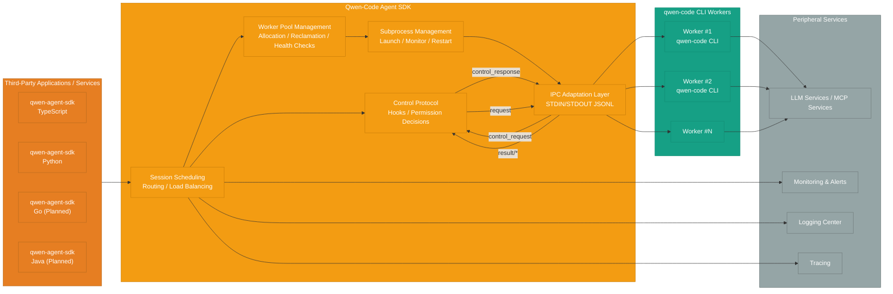
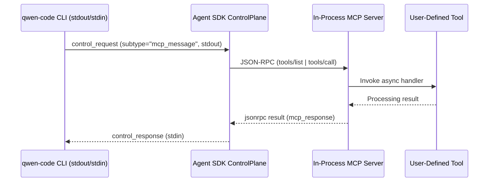

# Qwen-Code Agent Framework Architecture Design (Clean Version)

## Overview

| Field | Details |
| --- | --- |
| Design Version | v1.1 |
| Last Updated | 2025-10-10 |
| Architecture Scope | Qwen-Code Agent SDK and qwen-code CLI subprocess orchestration, control protocol, observability, and configuration system |
| Key Objectives | Provide third-party applications with unified IPC communication, worker pool governance, permission control, and tool bridging capabilities |

- Targets multi-language SDKs with a unified wrapper for the CLI subprocess lifecycle and JSONL protocol.
- Provides consistent interfaces for session scheduling, permission governance, Hook/MCP callbacks, logging, and metrics collection.
- Aligns protocol specifications with the Claude Agent SDK to lower collaboration and ecosystem integration costs across platforms.

## Architecture Overview

| Layer | Key Components | Responsibility Highlights |
| --- | --- | --- |
| Upstream Clients | TypeScript / Python / Go / Java SDK | Expose standard APIs, adapt to each language ecosystem, handle session onboarding and custom tool registration |
| Agent SDK Core | Router, ControlPlane, WorkerPool, ProcessMgr, IPC | Manage session routing, permission callbacks, worker pool lifecycle, and STDIO JSONL transport |
| CLI Worker | qwen-code CLI subprocess | Execute model inference and tool invocations, output `chat.completion*` / `result/*` / `control_request` according to the protocol |
| Peripheral Services | LLM/MCP, monitoring, logging, tracing | Provide model services, observability data, and integration with external systems |



- The Agent SDK and CLI share a bidirectional STDIN/STDOUT JSONL channel that transports events such as `chat.completion*`, `result/*`, and `control_request`.
- The CLI and SDK each integrate with OpenTelemetry, linking end-to-end traces through Trace/Span IDs to provide a unified troubleshooting view.
- Control protocol event semantics remain consistent with the CLI output format specification; see the companion `stream-json` RFC.

## Capability Mapping

| Capability Area | Key Content | Current Capability | Future Evolution |
| --- | --- | --- | --- |
| Session Scheduling | Session routing, worker binding, reuse strategies | Router and worker pool scheduling provided on the SDK side | Enhance branch sessions and sub-agent scheduling |
| Process Governance | Subprocess launch, monitoring, restart | ProcessMgr manages lifecycle and resource limits | Introduce resource quotas and automatic fault isolation |
| Control Protocol | Permission callbacks, hooks, MCP | ControlPlane handles `control_request` uniformly | Extend hook points and approval policies |
| IPC Protocol | JSON Lines, input/output formats | IPC layer implements `stream-json`/`stream-chunk-json` | Enrich event types and add protocol version negotiation |
| Observability | Logs, metrics, tracing | SDK and CLI each adopt OTel and emit structured logs | Unify metric naming and cross-component tracing analysis |

- Session scheduling and the control layer must uphold worker exclusivity, session isolation, and resource reclamation.
- The control protocol runs on a request/response model. The SDK must write back a `control_response` before the timeout to prevent the CLI from blocking.

## SDK Implementation Overview

| Language | Runtime Requirements | Distribution Form | Key Dependencies | Primary Capabilities | Status |
| --- | --- | --- | --- | --- | --- |
| Python | Python 3.10+ | `pyproject + hatchling`, namespace `qwen_agent_sdk`, ships `py.typed` | `anyio>=4`, `typing_extensions`, `mcp>=0.1`, `pydantic>=2` | `query()` fast entrypoint, `QwenSDKClient`, tool registration, permission/hook callbacks, logging, and OTel | Initial release |
| TypeScript | Node.js 18+ | Package `@qwen-agent/sdk`, ESM default export, `tsup` build artifacts | `@qwen-code/cli`, `zx/execa`, `eventemitter3` | `createAgentManager`, streaming iteration, permission callbacks, MCP tools, `settingSources` control | Initial release |
| Go | Expected Go 1.22+ | TBD | TBD | Reuse control protocol, expose common APIs | Planned |
| Java | Expected Java 17+ | TBD | TBD | SDK for enterprise scenarios | Planned |

### Python SDK Details

- **Use Cases**: Third-party backend services, scenarios that need custom interaction experiences, or server-side invocations.
- **API Design**:
  - `async def query(...) -> AsyncIterator[Message]`: Streaming interface aligned with Anthropic's `query()`.
  - `class QwenSDKClient`: Supports `async with`, session continuation, and interruption management.
  - `QwenAgentOptions`: Includes parameters such as `system_prompt`, `setting_sources`, `permission_mode`, `cwd`, and `fork_session`.
  - `@tool` decorator + `create_sdk_mcp_server`: Registers Python functions as MCP tools.
- **Implementation Highlights**:
  - `StdIOSubprocessTransport` launches the `qwen` CLI, writes JSONL, and reads streaming chunks.
  - `_handle_control_request()` invokes callbacks for `can_use_tool`, `hook_callback`, `mcp_message`, and other `subtype` values, then writes `control_response`.
  - `Query.initialize()` sends `control_request{subtype:"initialize"}` on first use to sync hook configuration and capability declarations.
  - Provides unified wrappers for `PermissionResult`, hook JSON, and MCP JSON-RPC payloads.
- **Logging and Observability**:
  - Outputs structured JSON logs by default and supports injecting `structlog`.
  - `options.stderr` can capture raw CLI error streams.
  - Plans to include built-in OpenTelemetry Tracer/Meter to record session latency, transport errors, and worker utilization.
- **Resilience**:
  - Automatically retries and forks sessions when the CLI crashes, preserving the latest successful result for resumable execution.
  - Returns `control_response{subtype:"error"}` when callbacks raise exceptions, triggering safe fallback in the CLI.
- **Testing Strategy**:
  - `pytest + pytest-asyncio` cover core flows.
  - `ruff + mypy` ensure code quality.
  - Examples such as `examples/quickstart.py` and `examples/mcp_calculator.py` demonstrate streaming consumption, permission callbacks, and tool registration.

### TypeScript SDK Details

- **API Capabilities**:
  - `createAgentManager(options)`: Provides `createSession`, `run`, and `forkSession`.
  - `session.stream(task)`: Returns an `AsyncIterable<AgentMessage>` for `for await` consumption.
  - `onPermissionRequest`: Returns permission decisions with `allow/deny/ask` plus optional policies.
  - `defineTools`: Registers MCP tools and shares context with the CLI session.
  - `agents` option: Supports inline multi-agent topologies and uses `forkSession` to build sub-agents.
- **Implementation Highlights**:
  - Uses `execa` to launch the CLI and parses stdout into `AgentStreamChunk`.
  - Maintains a `result/heartbeat` timer and automatically restarts workers on timeout.
  - `pendingControl` map uses `request_id` to route `control_request`.
  - Callback promises generate standardized `control_response` payloads; unregistered callbacks follow default policies.
  - `defineTools()` composes TypeScript functions into an in-process MCP server that forwards JSON-RPC.
  - During initialization, waits for the CLI's first `chat.completion` handshake and sends hook/tool capabilities via `control_request{subtype:"initialize"}`.
  - Records verbose logs for exceptional scenarios and returns `control_response{subtype:"error"}` as needed.
- **Engineering Practice**:
  - `tsup` produces `dist/esm`, `dist/cjs`, and `dist/types`.
  - Test matrix uses `vitest` + `tsx`, along with CLI mocks to validate streaming output and permission callbacks.
  - Provides `enableVerboseLogging()` toggle, `logger`/`stderr` callbacks, and an OpenTelemetry tracing plan.

### Other Language Paths (Planned)

- **Go/Java**: Plan to reuse the unified control protocol and worker scheduling strategy for enterprise and backend scenarios.
- SDK design and implementation details will be added after the Python/TypeScript versions stabilize.

## Control Protocol and MCP Integration

| Channel | Initiator | Typical Events | Acknowledgment Requirement | Purpose |
| --- | --- | --- | --- | --- |
| `chat.completion*` | CLI → SDK | Model responses, tool invocations, closing summaries | No acknowledgment required | Carry the main conversation flow |
| `result/*` | CLI → SDK | `result/command`, `result/heartbeat`, `result/cancel`, `x-qwen-session-event` | No acknowledgment required | Publish status updates and auxiliary information |
| `*request` | SDK → CLI | `command_hint_request`, `heartbeat_request`, `control/cancel` | CLI responds with `result/*` | Trigger immediate actions |
| `control_request` | CLI → SDK | `can_use_tool`, `hook_callback`, `mcp_message` | Must write back `control_response` | Execute permission checks, hooks, and MCP calls |

- All control events travel over the unified STDIN/STDOUT pipeline, and the SDK must respond within the agreed timeout.
- MCP integration creates the server inside the SDK process, avoiding additional subprocesses or network services.
- Authorization callbacks are decoupled from MCP invocations: the CLI still raises `can_use_tool`, the SDK runs the permission logic, and only then processes `mcp_message`.



- During initialization the CLI sends `control_request{subtype:"initialize"}` to synchronize hook configuration and capability declarations.
- When callbacks fail, the SDK must log the error and return `control_response{subtype:"error"}`, while the CLI follows its safety fallback policy.

## Worker Pool and Reuse

| Dimension | Design Highlights | Implementation Status |
| --- | --- | --- |
| State Machine | Idle → Occupied → Idle, one worker exclusively owns a session | Designed |
| Reuse Strategy | Keep the process alive after a session, clean up context, then reuse | Planned |
| Safety | Session isolation, resource cleanup, health checks | Delivered alongside worker pool implementation |
| Configuration Options | `min_workers`, `max_workers`, `idle_timeout`, `max_sessions_per_worker`, `health_check_interval` | Must be exposed in SDK/CLI configuration |
| Observability | Structured logs, metric export, trace linkage | SDK and CLI each integrate separately |

- Workers are dedicated to a single session at a time; once the session ends, they return to the idle pool.
- Reuse depends on clearing session variables, closing file handles, and resetting environment variables.
- Health checks cover memory leaks, zombie processes, and deadlocks; workers restart automatically on abnormal status.
- Typical configuration example:

```yaml
worker_pool:
  min_workers: 5
  max_workers: 50
  idle_timeout: 1800  # 30 minutes
  max_sessions_per_worker: 100
  health_check_interval: 60
```

- Session logs must record `session_id`, `prompt_id`, elapsed time, and command summaries, supporting forwarding to centralized logging systems.
- Metric collection focuses on active/idle counts, queue latency, restart counts, failure rate, etc., with traces propagated across SDK → CLI → tool calls.

## Configuration Injection and Settings Management

| Item | Capability Description | Notes |
| --- | --- | --- |
| `settings_profile` | Assign an isolated configuration to a single `QwenClient` | Affects the worker pool and subprocesses maintained by that client |
| `system/system_defaults` | Accept absolute paths or JSON overrides | Maps to CLI environment variables such as `QWEN_CODE_SYSTEM_SETTINGS_PATH` |
| `user/workspace` | JSON object or file/directory path | SDK generates `settings.json` in a temporary directory and mounts it to the CLI |
| `overrides` | Key-value overrides such as `model.name`, `tools.allowed` | Written directly into the temporary configuration file |

- Before workers launch the CLI they create an isolated configuration directory and inject it via new environment variables or `--settings-profile`.
- When the worker pool shuts down, it must clean up the temporary directory to prevent configuration leakage.
- Logs should print a profile summary (without sensitive data) to simplify diagnosing configuration mismatches.
- The CLI must add parsing logic for the corresponding environment variables and fallbacks.
- The current CLI does not yet support per-subprocess configuration; future RFCs/PRs will address it.

## Agent SDK Orchestration Capabilities

| Module | Core Responsibility | Current Status | Next Steps |
| --- | --- | --- | --- |
| IPC Wrapper | Parse/write JSON Lines, route events | CLI still uses plain-text STDIN and needs enhancement | Introduce `StdinReaderService`, `StdoutWriterService`, and strengthen `main()` |
| Process Management | Launch, monitor, enforce resource limits, log | Initial design | Establish resource quotas and automatic restart policies |
| Control Protocol | Permission callbacks, hook injection | CLI only implements ApprovalMode | Add permission APIs, hook system, and instrumentation |
| Input/Output Formats | `--input-format/--output-format` | CLI must support `stream-json` | Complete argument parsing and auto-disable TUI |
| Event Semantics | `result/heartbeat`, `control_request`, etc. | Under definition | Align implementation with the CLI output format RFC |

- `docs/ipc/qwen-chat-request-schema.json` extends OpenAI `/chat/completions` by adding `session_id`, `prompt_id`, `origin`, and `tool_call_id`.
- Error semantics must align with the CLI output format: fatal errors emit OpenAI-style error objects, while recoverable errors are reported through `chat.completion`.
- Need to guarantee immediate responses and event dispatch for `/`, `@`, and `?` command requests.

## Observability and Debugging

| Area | Highlights |
| --- | --- |
| Logging | SDK writes structured JSON by default; CLI can forward stderr and allows injecting a `logger` |
| Metrics | SDK/CLI each export active workers, queue latency, error counts, etc., with a plan to unify metric naming |
| Trace | Create session-level spans, propagate through CLI and tool call chains, achieve end-to-end troubleshooting |
| Debugging Tools | TypeScript offers `enableVerboseLogging()`, Python captures `debug_stderr`, both plan to add OTel |

- Third-party services should record message sequences to support auditing and replay.
- CLI command samples can be used for local troubleshooting (see the output format RFC).

## Integration Model

| Pattern | Applicable Scenarios | Key Traits |
| --- | --- | --- |
| Host Process Integrates SDK | IDE plugins, enterprise internal tools, CLI extensions | Launch worker pools inside the host process, exchange IPC JSONL with the CLI, support synchronous and streaming output |

**Quick Start Example**:

```python
from qwen_agent_sdk import QwenClient

with QwenClient(binary_path="qwen", model="qwen3-coder-plus") as client:
    result = client.chat(
        task="Scan and fix potential bugs in main.py",
        workspace="/repos/demo"
    )
    print(result.summary)
```

- Third-party programs can rely on `qwen-agent-sdk` to manage sessions, tools, and permission policies in a unified way.
- The SDK must support session replay and cancellation, heartbeat maintenance, and timeout control.

## Open Items and Future Work

| Direction | Pending Tasks |
| --- | --- |
| CLI Protocol Support | Complete `stream-json` input/output, event semantics, and handshake metadata |
| Control Protocol | Implement permission callback APIs, hook instrumentation, MCP `mcp_message` pathway |
| Worker Pool | Improve health checks, resource quotas, and automatic fault isolation |
| Configuration System | Add CLI support for `--settings-profile` and related environment variables |
| Multi-Language SDKs | Expand Go/Java versions, build a unified test matrix and documentation |
| Observability | Jointly define metric names and trace sampling strategies, refine logging guidelines |
