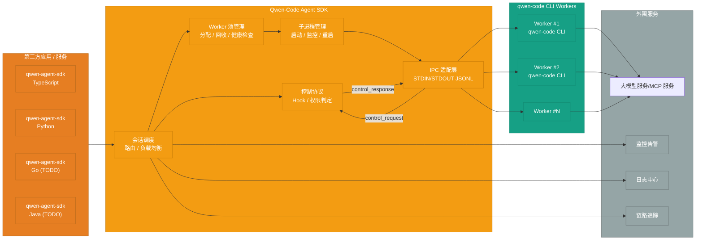
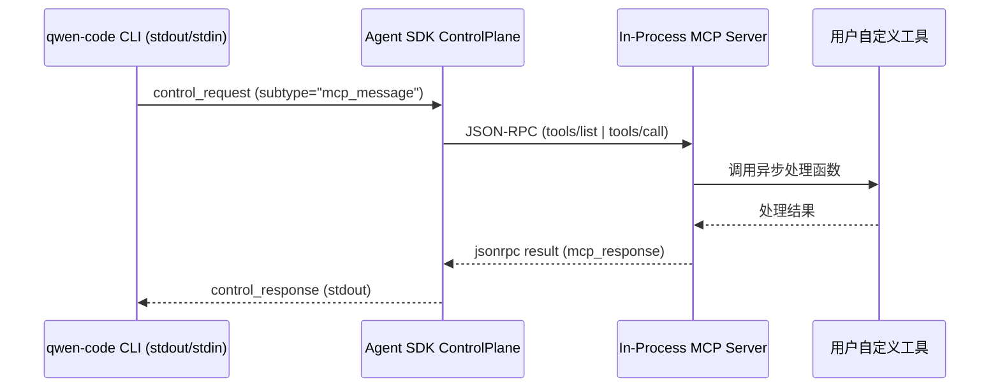

# Qwen-Code Agent 框架架构设计

> **设计版本**: v1.1
> **最后更新**: 2025-10-10

## 设计说明

本文档描述了 Qwen-Code Agent 框架的完整架构设计。

### 重要概念澄清

**核心组件: Qwen-Code Agent SDK**

文档聚焦于 **Qwen-Code Agent SDK** 的设计,基于统一的IPC协议为各语言提供对应的agent sdk，给第三方应用提供qwen code集成开发，提供对qwen code统一的会话调度、进程管理与控制协议能力。

- **作用**:
  - 在宿主应用进程内封装会话路由与控制协议
  - 负责 Worker 池的生命周期、健康检查与调度
  - 提供一致的 集成API，符合qwen code定义的IPC/JSONL 抽象,屏蔽 CLI 细节
- **形态**: SDK

核心功能:

- 会话调度与路由
- CLI 子进程生命周期与资源治理
- 控制协议 Hook / 权限判定
- 观察性数据采集 (日志、指标、追踪)

## 完整系统架构



> **双向通信说明**:
> - Agent SDK 与 qwen-code CLI 共用 STDIN/STDOUT 建立双向 JSONL 通道。
> - CLI 将 `chat.completion`/`result/*` 及 `control_request` 等事件 (比如工具权限请求、MCP 调用) 逐行写入 stdout。
> - SDK 读取事件后, 视需求通过 stdin 写回 `control_response` 或其它控制消息, 保持状态一致。
> - 当事件为 `control_request{subtype:"mcp_message"}` 时, ControlPlane 会把 JSON-RPC 转发给 In-Process MCP Server 执行对应工具, 再把 `mcp_response` 封装进 `control_response` 回传 CLI, 形成闭环。

## 关键组件说明

### 1. Qwen-Code Agent Client SDK

- **多语言支持**:
  - `qwen-agent-sdk` (Python): 首发绑定, 复用 TypeScript 控制协议并提供 Pythonic API
  - `qwen-agent-sdk` (TypeScript): 核心实现, 提供子进程编排与控制协议能力
  - `qwen-agent-sdk` (Go): TODO
  - `qwen-agent-sdk` (Java): TODO

- **适用场景**:
  - 第三方后端服务集成
  - 希望自定义交互层体验的场景
  - 服务端到服务端调用

- **核心功能**:
- 同步/异步任务执行
- 流式输出
- 会话管理
- 错误处理与重试
- In-Process MCP Server 工具桥接

#### 通信模式

- **IPC 模式**: SDK 启动本地 `qwen` 子进程,以 JSON Lines 协议进行进程间通信。

> 📘 IPC 模式的协议与最新 CLI IPC 草案详见《qwen-code-cli-output-format-stream-json-rfc_cn.md》。

#### In-Process MCP Server

- **形态**: SDK 依赖 `mcp>=0.1` 在宿主进程内创建 MCP Server, 将通过 `@tool`/`defineTools` 定义的函数注册为工具, 无需额外子进程或网络服务。
- **事件链路**: 当 CLI 输出 `control_request{subtype:"mcp_message"}` 到 stdout 时, SDK 把 JSON-RPC 内容转发给本地 MCP Server 执行 `tools/list`、`tools/call` 等操作, 并把结果封装为 `control_response` 回写 stdin。
- **授权分工**: 工具执行前的授权仍由 CLI 触发 `control_request{subtype:"can_use_tool"}` 等事件并交由 SDK 回调处理, 与 MCP 调用链路解耦, 保持权限判定的独立性。
- **优势**: 复用 CLI 权限判定链路, 让工具实现保持低延迟; Hook 体系当前仍待 CLI 侧落地, 届时可沿同一通路接入。整体方案与 Claude Agent SDK 的 In-Process 实践对齐, 便于多语言同步拓展。



**集成方式**:

```python
# 第三方通过 Agent SDK 集成
from qwen_agent_client import QwenAgentClient
client = QwenAgentClient(api_key="...", base_url="...")
result = client.execute(task="...", context={...})
```

## 各语言 SDK 技术选型

### qwen-agent-sdk-python

#### 运行时与分发

- **语言要求**: Python 3.10+, 与 Anthropic Python SDK 一致, 保障 `typing.Annotated`, `match` 等语法可用。
- **包结构**: 采用 `pyproject.toml` + `hatchling` 构建, 发布 `py.typed` 以提供类型提示, 命名空间为 `qwen_agent_sdk`。
- **环境依赖**: 需预装 Node.js 与 `qwen-code` CLI, SDK 启动前通过 `which qwen` 或 `QWEN_BIN` 环境变量定位二进制。

#### 核心依赖

- `anyio>=4`: 与 Anthropic SDK 一致, 统一 async/await 事件循环并兼容 Trio。
- `typing_extensions`: 兼容 3.10/3.11 的 `TypedDict`, `NotRequired` 能力。
- `mcp>=0.1`: 复用 In-Process MCP Server 能力, 支持装饰器式工具定义。
- `pydantic>=2` (新增): 用于严格校验 JSONL 消息、权限响应与 Hook payload。

#### API 设计

- **快速函数**: `async def query(...) -> AsyncIterator[Message]`, 语义与 Anthropic `query()` 对齐, 支持字符串与 `AsyncIterable` 输入。
- **会话客户端**: `class QwenSDKClient`, 支持 `async with` 上下文、会话续写与中断, 暴露 `receive_response()` 流式读取。
- **选项对象**: `QwenAgentOptions`, 对齐 TypeScript `AgentOptions`, 含 `system_prompt`, `setting_sources`, `permission_mode`, `cwd`, `fork_session`。
- **工具注册**: `@tool` 装饰器 + `create_sdk_mcp_server`, 允许 Python 原生函数作为 CLI 工具。

#### 技术实现要点

- **Transport 抽象**: 提供 `StdIOSubprocessTransport`, 负责启动 `qwen` CLI、写入 JSONL、读取流式 chunk, 并将 CLI 事件映射为 Python 数据类。
- **权限回调**: 设计 `CanUseTool` 协议, 输入工具名、payload、上下文, 返回 `PermissionResult`, 支持自动接受/拒绝与补充规则。
- **Hook 体系**: 支持 `PreToolUse`、`PostToolUse`、`UserPromptSubmit` 等事件, 允许返回 JSON 指令修改会话 (参考 Anthropic Hook JSON)。
- **可插拔日志**: 提供基于 `structlog` 的观察性接口, 默认输出标准 JSON 日志, 支持注入自定义 logger。
- **错误恢复**: 针对 CLI 崩溃提供自动重试与会话 fork, 保存最后一次成功结果以便断点续传。

#### 双向控制协议实现参考 (对齐 Claude Agent SDK)

- **STDIO 对称信道**: 对齐《qwen-code-cli-output-format-stream-json-rfc_cn.md》定义的 `control_request`/`control_response` 语义, `SubprocessCLITransport` 始终通过同一 STDIN/STDOUT 管道处理正向/反向消息, 无需额外套接字。
- **事件监听与解复用**: `Query._read_messages()` 按行读取 CLI 输出, 将 `type=control_request` 的 JSON 派发给 `_handle_control_request()`, 并通过 `pending_control_responses` + `request_id` 映射保证多请求并发时的正确回执。
- **权限 / Hook / MCP 托管**: `_handle_control_request()` 将 `subtype` 映射到对应的回调: `can_use_tool` 触发 SDK 提供的权限协程, `hook_callback` 执行注册 Hook, `mcp_message` 则桥接到 in-process MCP Server (`tools/list`、`tools/call`、`initialize` 等)。处理结果统一写入 STDIN, 形成 `control_response` 行。
- **初始化握手**: 流式模式下 `Query.initialize()` 先发起 `control_request{subtype:"initialize"}`, 同步 Hook 配置, 使 CLI 在后续事件中具备回调 SDK 的上下文与能力声明。
- **故障回退**: 若回调抛异常, SDK 会返回 `subtype:error` 的 `control_response`, CLI 可依协议退回默认策略 (例如自动拒绝危险工具)。对齐 Claude SDK 的处理方式可降低双方协议分歧, 也是实现 SDK 端双向通信的参考蓝本。

#### 测试与示例

- **测试栈**: 采用 `pytest + pytest-asyncio` 与 `ruff + mypy` 形成与 Anthropic 仓库一致的质量门槛。
- **示例**: 提供 `examples/quickstart.py`, `examples/mcp_calculator.py` 等, 展示工具注册、流式消费、权限回调落地。

### qwen-agent-sdk-typescript

#### 运行时与分发

- **Node 要求**: Node.js 18+, 与 Anthropic TypeScript SDK 保持一致, 支持 `AbortController`, `EventTarget` 等 API。
- **包结构**: 主包 `@qwen-agent/sdk` 使用 ESM 默认导出, 通过 `exports` 字段同时暴露 `import` 与 `require` 入口; 类型声明由 `TypeScript 5.x` 编译生成。
- **构建流水线**: 采用 `tsup` 打包出 `dist/esm` 与 `dist/cjs`, 并生成 `dist/types`。

#### 核心依赖

- `@qwen-agent/protocol`: JSONL schema 与类型定义, 由核心仓库生成。
- `@qwen-code/cli` (peerDependency): 由宿主应用负责安装, SDK 仅负责调度。
- `zx`/`execa`: 子进程管理与跨平台管道封装。
- `eventemitter3`: 会话事件派发。

#### API 设计

- **AgentClient**: `createAgentManager(options)` 返回具备 `createSession`, `run`, `forkSession` 能力的管理器, 语义对齐 Anthropic `ClaudeAgent`。
- **流式 API**: `session.stream(task)` 返回 `AsyncIterable<AgentMessage>`, 支持 `for await` 迭代。
- **权限体系**: 暴露 `onPermissionRequest` 回调, 允许应用返回 `allow/deny/ask` 与额外规则。
- **自定义工具**: 支持内嵌 MCP 服务 (`defineTools`), 允许通过 TypeScript 函数注册工具, 与 CLI 会话共享上下文。
- **设置源控制**: `settingSources` 默认关闭, 需显式声明 `["user","project","local"]` 方可加载对应文件。
- **子代理**: `agents` 选项允许内联定义多代理拓扑, 结合 `forkSession` 进行会话分支。

#### 技术实现要点

- **子进程编排**: 使用 `execa` 启动 `qwen` CLI, 统一将 stdout 解析为 `AgentStreamChunk`, 并通过 `AbortSignal` 支持取消。
- **心跳与超时**: 管理器维护 `result/heartbeat` 定时器, 超时自动触发重启与会话恢复。
- **权限同步**: 将 `onPermissionRequest` 结果转为 JSONL `control_response`, 保证与 Python 绑定行为一致。
- **调试工具**: 提供 `enableVerboseLogging()` 开关, 输出 CLI 命令、payload、耗时指标。
- **测试矩阵**: 使用 `vitest` + `tsx` 覆盖, 结合 `@qwen-code/cli` mock 校验流式输出与权限回调。

#### 双向控制协议实现参考 (对齐 Claude Agent SDK TS)

- **统一 STDIO 通道**: 复用 CLI `stream-json` 定义的结构, `ProcessTransport` 将 stdout 逐行解码 (`JSON.parse`) 并通过 `EventEmitter` 推送 `control_request`、`result/*`、`chat.completion*` 等事件；所有反向 `control_response` 均通过同一子进程 stdin 写回, 遵循 RFC 中的 JSON Lines 约定。
- **请求/响应路由**: `createAgentManager()` 在会话级维护 `pendingControl` 映射, `request_id` 作为 key, 保障 `control_request` 并发时的正确配对；若超时则触发 `AbortController.abort()` 并向 CLI 返回 `subtype:"error"`。
- **权限与 Hook 回调**: `onPermissionRequest`、`onHookEvent` 等回调被包装为 Promise, 统一生成 `control_response` payload (`{"response":{"behavior":"allow"}}` 等); 若上层未注册回调, SDK 直接返回 RFC 规定的默认策略, 避免 CLI 阻塞。
- **MCP 工具桥接**: `defineTools()` 将 TypeScript 函数组装为 SDK 内嵌 MCP server, CLI 通过 `control_request{subtype:"mcp_message"}` 发起 `tools/list`/`tools/call`, SDK 使用 `jsonrpc` 透传至 in-process server 并回写 `mcp_response` 字段, 行为与 Python 版本一致。
- **初始化握手**: 会话启动时, SDK 主动等待 CLI 首条 `chat.completion` 握手元数据 (`protocol_version`,`capabilities`), 同时根据 RFC 在首个 `control_request{subtype:"initialize"}` 中附带 Hook 配置与工具能力声明, 以便 CLI 构建完整的会话态。
- **异常降级**: 当反向回调抛出异常或序列化失败时, SDK 会记录 verbose 日志并发送 `control_response{subtype:"error"}`, 提醒 CLI 走安全回退路径 (例如拒绝危险命令), 与 Anthropics TypeScript SDK 的容错策略保持一致。

### 其它语言绑定 (TODO)

- **Go/Java**: 仅保留协议占位, 等 TypeScript/Python SDK 发布 GA 后再依据业务需求补齐。
- **统一目标**: 待声明的语言需消费同一 `@qwen-agent/protocol` 版本, 并复用当前 CLI 工具链, 不另起分支实现。

### 2. Qwen-Code Agent SDK (子进程调度层)

> - IPC 封装: (StdinReader, StdoutWriter, 消息路由)
> - 控制协议: (ControlProtocolService, Hook Registry)

Qwen-Code Agent SDK 直接管理 qwen-code CLI 子进程,负责通信、生命周期与权限控制。

- **IPC 封装**:
  - 基于 STDIN/STDOUT 的 JSON Lines 协议,输入遵循 `docs/ipc/qwen-chat-request-schema.json`(扩展自 OpenAI `/chat/completions`,包含 `session_id`、`prompt_id`、`tool_call_id` 等会话字段)。
  - CLI 需提供 `--input-format {text,stream-json}` 与 `--output-format {text,stream-json,stream-chunk-json}` 参数,结构化模式自动禁用 TUI,仅 `text` 模式保留原有人机交互。
  - 输出逐行写入 OpenAI 风格的 `chat.completion` / `chat.completion.chunk` 对象;首条响应需在 `metadata` 中携带 `protocol_version`、`input_format`、`output_format` 以及 `capabilities`（需显式包含 `chat.completion.chunk` 能力位）等握手信息。
  - 事件语义需覆盖 `result/heartbeat`、`result/cancel`、`x-qwen-session-event` 与 `control_request/control_response`,并定义对应的错误对象与回退策略。
  - **当前状态**: qwen-code 仅支持简单的 STDIN 文本读取 (非 JSON Lines)
  - **需要工作**:
    - 新增 `StdinReaderService` (~200 行): 解析结构化请求并保持 `/`、`@`、`?` 命令的即时回执。
    - 新增 `StdoutWriterService` (~150 行): 输出 `chat.completion` / `chat.completion.chunk` JSON Lines,封装错误语义。
    - 改造 `main()` 入口支持握手元数据、事件分发与流式模式 (~100 行)。
    - 扩展 CLI 参数解析,落实完整格式选项及 TUI 自动禁用逻辑。
    - 实现 `result/heartbeat`、`result/cancel`、`x-qwen-session-event`、`control_request/control_response` 的调度骨架。

- **进程管理**:
  - Worker 进程启动、监控、异常重启
  - 进程生命周期管理
  - 资源限制 (CPU/内存/超时)

- **控制协议**:
  - 工具权限动态授予/撤销
  - Hook 回调 (pre-commit、post-execute 等)
  - 会话级配置传递
  - **当前状态**: qwen-code 有 `ApprovalMode` 权限机制,但不支持程序化回调
  - **需要工作**:
    - 新增权限回调接口
    - 新增 Hooks 系统和事件机制
    - 在工具执行流程中插入 Hook 点

### 3. Qwen-Code Workers 进程池

热启动的 CLI 进程池,每个 Worker 独立运行。

**环境说明**: Worker 本质是 qwen-code CLI 子进程,其容器/沙箱与工具桥接逻辑均由 CLI 自主管理,SDK 只负责通过 STDIN/STDOUT 进行调度与控制。

**Worker 状态机**:

```
空闲 (Idle)
  ↓ [新会话分配]
占用 (Busy) - 绑定到 session_xxx
  ↓ [会话结束]
空闲 (Idle) - 等待新会话复用
```

**关键特性**:

- **独占机制**:一个 Worker 一次只能服务一个会话,保证会话隔离。
- **会话绑定**:Worker 与会话 ID 绑定,期间不接受其他任务。
- **复用机制**:
  - 会话结束后 Worker **不会自动销毁**
  - Worker 返回空闲池,等待新会话分配
  - 新会话复用现有进程,创建新的会话上下文
  - 大幅减少冷启动时间,提高响应速度

**Worker 复用流程**:

```
1. 会话 A 结束 → Worker #1 状态变为 [空闲]
2. 新会话 B 到达 → 协调器分配 Worker #1
3. Worker #1 状态变为 [占用 - session_B]
4. Worker #1 在同一进程内创建新会话上下文
5. 会话 B 执行完毕 → Worker #1 再次变为 [空闲]
```

**进程池配置**:

- `min_workers`:最小保活 Worker 数量
- `max_workers`:最大 Worker 数量上限
- `idle_timeout`:空闲 Worker 超时回收时间 (默认 30 分钟)
- `max_concurrent_sessions`:单 Worker 生命周期内最大服务会话数

## Worker 复用机制详解

### 为什么需要 Worker 复用?

**问题**:每次新会话启动全新进程会导致:

- 进程冷启动耗时 (3-5 秒)
- 模型加载耗时 (如果涉及本地模型)
- 资源开销大 (频繁创建/销毁进程)

**方案**:Worker 进程复用

- 进程保持运行,会话结束后只清理会话上下文
- 新会话到达时直接在现有进程中创建新会话
- 响应速度提升 **10-20 倍**

### 复用安全性保障

1. **会话隔离**:
   - 每个会话独立的上下文空间
   - 会话结束时清理所有会话变量和状态
   - 下一个会话无法访问上一个会话的数据

2. **资源清理**:
   - 临时文件自动清理
   - 环境变量重置
   - 打开的文件句柄关闭

3. **健康检查**:
   - 定期检测 Worker 内存泄漏
   - 检测僵尸进程或卡死状态
   - 异常 Worker 自动重启

### 复用策略配置

```yaml
worker_pool:
  # 最小保活 Worker 数
  min_workers: 5

  # 最大 Worker 数
  max_workers: 50

  # 空闲 Worker 超时回收 (秒)
  idle_timeout: 1800  # 30 分钟

  # 单个 Worker 最大服务会话数 (防止内存泄漏)
  max_sessions_per_worker: 100

  # Worker 健康检查间隔 (秒)
  health_check_interval: 60
```

## 集成模式

### 模式一: 宿主进程内嵌 SDK

- **适用场景**: IDE 插件、企业内部工具、CLI 扩展等需要最小化依赖的场合。
- **关键特性**:
  - SDK 直接在宿主进程内启动与管理 Worker 池
  - 通过 IPC JSONL 协议与 qwen-code CLI 通信
  - 可同步或流式获取会话输出

**快速上手示例**:

```python
from qwen_agent_sdk import QwenClient

with QwenClient(binary_path="qwen", model="qwen3-coder-plus") as client:
    result = client.chat(
        task="扫描并修复 main.py 中的潜在 bug",
        workspace="/repos/demo"
    )
    print(result.summary)
```

### 模式二: 服务端封装 SDK

- **适用场景**: 需要集中调度或为多语言后端提供统一接口的企业服务。
- **关键特性**:
  - 宿主服务将 SDK 作为子进程管理层,封装自定义 RPC/HTTP
  - 可结合企业现有鉴权、审计与配额体系
  - 便于集中化运营、统计与运维

**服务封装伪代码**:

```typescript
import Fastify from 'fastify';
import { createAgentManager } from '@qwen-agent/sdk';

const app = Fastify();
const manager = await createAgentManager({
  binaryPath: process.env.QWEN_BIN || 'qwen',
  maxWorkers: 8
});

app.post('/v1/agent/run', async (req, reply) => {
  const { task, workspace } = req.body;
  const session = await manager.createSession();
  const result = await session.run({ task, workspace });
  return reply.send(result);
});

await app.listen({ port: 6001 });
```

两种模式均通过同一套 SDK API 管理会话、工具权限与上下文,差异主要在于部署形态与对外暴露方式。

## 模块设计概述

### IPC 协议基础

**目标**: 让 qwen-code CLI 支持 JSON Lines IPC 通信

**依赖**: 无

**任务**:

1. 扩展 CLI 参数解析: 支持 `--input-format {text,stream-json}` 与 `--output-format {text,stream-json,stream-chunk-json}`,结构化模式自动禁用 TUI。
2. 实现 `StdinReaderService`: 解析 `qwen-chat-request-schema` 请求,保留 `/`、`@`、`?` 命令即时反馈。
3. 实现 `StdoutWriterService`: 输出携带握手元数据的 `chat.completion` / `chat.completion.chunk` JSON Lines,统一错误语义。
4. 改造 `main()` 入口: 初始化协议握手、分发 `result/*` 与 `control_request/control_response` 事件。
5. 补齐事件流: 实现 `result/heartbeat`、`result/cancel`、`x-qwen-session-event`、`control_request/control_response` 的内部管线。
6. 编写 IPC 协议测试: 覆盖握手、结构化输入、chunk 输出与错误/控制事件。

**可交付成果**:

```bash
echo '{"model":"qwen-coder","messages":[{"role":"user","content":"你好"}],"session_id":"demo-session-1"}' | \
  qwen --input-format stream-json --output-format stream-json

# 预期输出(逐行 JSON Lines)
{"object":"chat.completion","id":"chatcmpl-demo","created":1739430000,"model":"qwen-coder","metadata":{"protocol_version":"1.0","input_format":"stream-json","output_format":"stream-json","capabilities":{"chat.completion":true,"chat.completion.chunk":true}},"choices":[{"index":0,"message":{"role":"assistant","content":"收到,开始处理。"},"finish_reason":"stop"}]}
```
