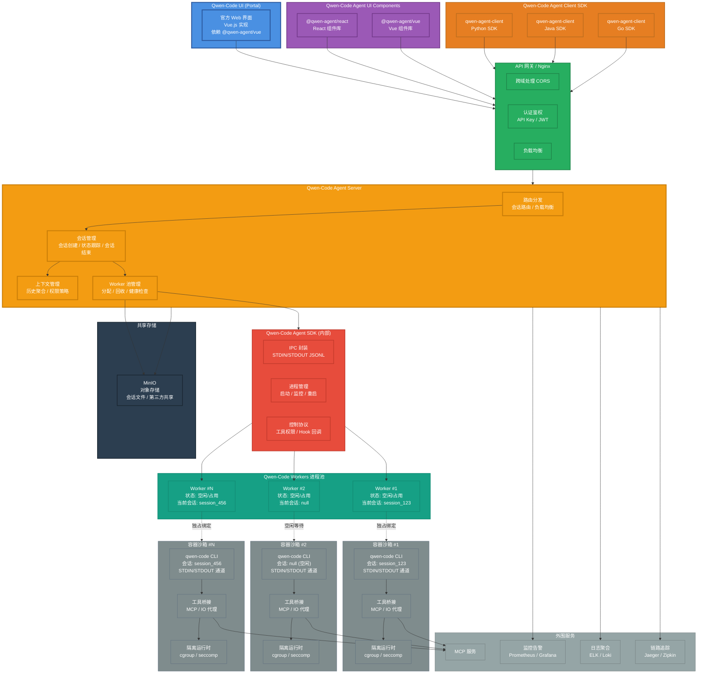
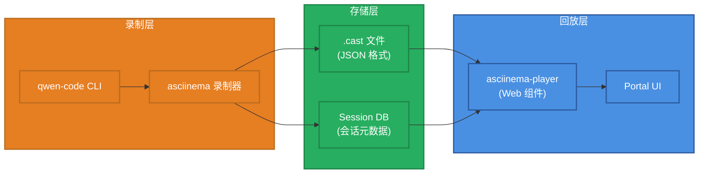

# Qwen-Code Agent 框架架构设计

> **设计版本**: v1.1
> **最后更新**: 2025-10-10

## 设计说明

本文档描述了 Qwen-Code Agent 框架的完整架构设计。

### 重要概念澄清

**核心组件: Qwen-Code Agent Server**

本框架的核心服务组件统一命名为 **Qwen-Code Agent Server**:

- **作用**:
  - 作为前端和 CLI 之间的服务器
  - 协调和管理会话、Worker 池
  - 提供 WebSocket 和 RESTful API
- **实现**: 对应 `@qwen-agent/server` npm 包

核心功能:
- WebSocket 服务器和 RESTful API
- CLI 进程管理 (spawn/输出捕获)
- 会话管理和 Worker 池管理
- 认证系统 (JWT)

## 完整系统架构



## 终端会话回放系统

### 基于 asciinema 的终端回放

为了更好地记录和回放 Agent 的执行过程,框架集成了基于 asciinema 的终端会话回放系统。

#### 核心组件



#### 工作流程

**1. 录制阶段**:
```bash
# Qwen-Code Agent Server 启动 CLI 时自动录制
asciinema rec --stdin --title "Session: session_123" \
  --command "qwen --prompt 'Fix the bug in main.py'" \
  sessions/session_123.cast
```

**2. 存储格式** (.cast 文件):
```json
{
  "version": 2,
  "width": 120,
  "height": 40,
  "timestamp": 1696867200,
  "title": "Session: session_123",
  "env": {
    "SHELL": "/bin/bash",
    "TERM": "xterm-256color"
  }
}
[0.1, "o", "$ qwen --prompt 'Fix the bug in main.py'\n"]
[0.5, "o", "Reading file main.py...\n"]
[1.2, "o", "Found bug on line 42\n"]
[2.0, "o", "Applying fix...\n"]
[2.5, "o", "Done!\n"]
```

**3. 回放集成** (Portal UI):
```typescript
// Portal 中集成 asciinema-player
import { AsciinemaPlayer } from 'asciinema-player';

<AsciinemaPlayer
  src="/api/sessions/session_123/recording"
  cols={120}
  rows={40}
  autoPlay={false}
  speed={1.0}
  controls={true}
  theme="monokai"
/>
```

#### 功能特性

| 功能 | 说明 | 实现方式 |
|------|------|---------|
| **自动录制** | 每个会话自动录制终端输出 | asciinema rec + CLI wrapper |
| **精确回放** | 按时间戳精确还原执行过程 | .cast 文件 + asciinema-player |
| **速度控制** | 支持暂停、快进、倍速播放 | asciinema-player 内置功能 |
| **文本搜索** | 在录制内容中搜索文本 | Portal 自定义搜索功能 |
| **下载分享** | 导出 .cast 文件或生成分享链接 | RESTful API |

#### API 端点

```typescript
// 获取会话录制
GET /api/sessions/{sessionId}/recording
Response: .cast 文件 (application/json)

// 获取会话录制元数据
GET /api/sessions/{sessionId}/recording/metadata
Response: {
  "sessionId": "session_123",
  "duration": 15.2,
  "size": 45678,
  "createdAt": "2025-10-10T10:30:00Z"
}

// 下载会话录制
GET /api/sessions/{sessionId}/recording/download
Response: session_123.cast 文件下载
```

#### 存储策略

```yaml
recording:
  # 录制配置
  enabled: true                    # 是否启用录制
  auto_start: true                 # 是否自动开始录制

  # 存储配置
  storage_path: ./sessions         # 录制文件存储路径
  max_size_mb: 100                 # 单个录制文件最大大小 (MB)
  retention_days: 30               # 录制文件保留天数

  # 压缩配置
  compress: true                   # 是否压缩旧录制文件
  compress_after_days: 7           # 多少天后压缩
```

#### 隐私和安全

- **敏感信息过滤**: 自动过滤密码、API Key 等敏感输出
- **访问控制**: 只有会话所有者可以访问录制
- **加密存储**: 可选的 .cast 文件加密存储
- **自动清理**: 超过保留期的录制自动删除

#### 使用场景

1. **调试分析**: 回放会话过程,定位问题
2. **操作演示**: 展示 Agent 的工作流程
3. **培训教学**: 用于团队培训和知识分享
4. **审计追踪**: 记录所有操作,满足合规要求

## 系统组成

### 完整组件构成

```
qwen-code-agent-framework =
    qwen-code-ui (Portal)
    + qwen-code-agent-ui-components (Vue/React)
    + qwen-code-agent-client-sdk (Python/Java/Go)
    + qwen-code-agent-server (核心服务)
    + qwen-code-agent-sdk (内部)
    + qwen-code-workers (进程池/实例)
    + minio-object-storage (共享对象存储)
```

## 关键组件说明

### 1. Qwen-Code UI (Portal)
- **官方 Web 界面**:基于 **Vue.js** 构建的完整 Web 应用,提供开箱即用的 Agent 交互界面。
- **技术栈**: Vue.js + Vite + Tailwind CSS
- **组件依赖**: 依赖 `@qwen-agent/vue` 组件库
- **功能特性**:代码编辑、终端交互、文件浏览、会话管理、任务监控等完整功能。
- **部署方式**:可独立部署,通过 Nginx 网关访问后端 API,或直接连接 Backend Server。

### 2. Qwen-Code Agent UI Components

> **✅ 可行性确认**: 已通过实际案例验证(Qwen-CLI-UI、Gemini-CLI-UI)
> **架构说明**: UI Components 通过 Qwen-Code Agent Server 与 CLI 交互,不依赖 Ink 组件

#### 2.1 架构模式

UI Components 采用三层架构:

```
┌─────────────────────────────────────┐
│   Frontend (React/Vue Web 组件)     │
│   - QwenChat                        │
│   - QwenFileTree                    │
│   - QwenEditor                      │
└─────────────┬───────────────────────┘
              │ 相对路径 /api
              │ (开发: Webpack/Vite 代理)
              │ (生产: Nginx 反向代理)
              ▼
┌─────────────────────────────────────┐
│   Qwen-Code Agent Server            │
│   (独立可运行服务)                    │
│   - WebSocket 服务器                 │
│   - RESTful API                     │
│   - CLI 进程管理                     │
└─────────────┬───────────────────────┘
              │ child_process.spawn()
              ▼
┌─────────────────────────────────────┐
│   qwen-code CLI (子进程)            │
│   - --prompt 参数接收输入             │
│   - STDOUT 输出结果                  │
└─────────────────────────────────────┘
```

**关键点**:
- ✅ **UI Components 是全新的 React/Vue Web 组件**,不复用 qwen-code 的 Ink 组件
- ✅ **Qwen-Code Agent Server 作为独立服务**,负责 CLI 进程管理和输出捕获
- ✅ **利用现有非交互式模式**: qwen-code 已支持 `--prompt` 参数和 STDOUT 输出
- ✅ **反向代理部署**: 前端通过相对路径访问后端,不直接指定后端地址

#### 2.2 组件库设计

- **React 组件库** (`@qwen-agent/react`):
  - 提供 `<QwenChat>`、`<QwenFileTree>`、`<QwenEditor>`、`<QwenTerminal>` 等组件
  - 通过 WebSocket 与 Qwen-Code Agent Server 通信
  - 适用于第三方 React 应用集成

- **Vue 组件库** (`@qwen-agent/vue`):
  - 提供对应的 Vue 3 Composition API 组件
  - 同样通过 WebSocket 与 Qwen-Code Agent Server 通信
  - 适用于第三方 Vue 应用集成

- **Qwen-Code Agent Server** (`@qwen-agent/server`):
  - **独立可运行的服务** (不是 SDK)
  - 通过 CLI 启动: `npx @qwen-agent/server start`
  - CLI 进程管理 (spawn、输出捕获、进程池)
  - WebSocket 服务器 + RESTful API
  - 认证系统 (JWT)

**集成方式**:

**开发环境配置** (Vite 反向代理):
```typescript
// vite.config.js
export default {
  server: {
    proxy: {
      '/api': {
        target: 'http://localhost:5008',
        changeOrigin: true,
        ws: true  // WebSocket 支持
      }
    }
  }
}
```

**前端组件使用** (相对路径):
```jsx
// Frontend: 使用 React 组件 (相对路径访问后端)
import { QwenChat, QwenFileTree } from '@qwen-agent/react';

function MyApp() {
  return (
    <div className="app">
      <QwenChat
        apiUrl="/api"  // ✅ 使用相对路径,由 Webpack/Nginx 代理
        projectPath="/path/to/project"
        model="qwen3-coder-plus"
      />
      <QwenFileTree apiUrl="/api" projectPath="/path/to/project" />
    </div>
  );
}
```

**后端服务启动**:
```bash
# 安装
npm install -g @qwen-agent/server

# 启动服务
qwen-server start --port 5008 --config ./qwen-server.config.js
```

**生产环境配置** (Nginx 反向代理):
```nginx
# nginx.conf
location /api/ {
  proxy_pass http://localhost:5008/;
  proxy_http_version 1.1;
  proxy_set_header Upgrade $http_upgrade;
  proxy_set_header Connection "upgrade";
  proxy_set_header Host $host;
  proxy_set_header X-Real-IP $remote_addr;
}
```

**实际案例参考**:
- [Qwen-CLI-UI](https://github.com/cruzyjapan/Qwen-CLI-UI) - React + Vite + Express
- [Gemini-CLI-UI](https://github.com/cruzyjapan/Gemini-CLI-UI) - 类似架构
- [Claude Code UI](https://github.com/siteboon/claudecodeui) - 通用 CLI UI 框架

#### 2.3 UI Components 内部架构设计

为了同时支持"直连本项目后端"和"包装+自有后端"两种集成模式,UI Components 采用**三层可插拔架构**:

##### 架构分层

```
┌─────────────────────────────────────────────┐
│         视图层 (View Layer)                  │
│  - React/Vue 组件                            │
│  - UI 渲染逻辑                               │
│  - 用户交互处理                              │
└─────────────────┬───────────────────────────┘
                  │ Props/Events
┌─────────────────▼───────────────────────────┐
│         数据层 (Data Layer)                  │
│  - 状态管理 (State)                          │
│  - 业务逻辑 (Logic)                          │
│  - 数据转换 (Transform)                      │
└─────────────────┬───────────────────────────┘
                  │ 依赖注入
┌─────────────────▼───────────────────────────┐
│         API 层 (API Layer) ✨可插拔         │
│  - HTTP Client                               │
│  - WebSocket Client                          │
│  - 请求/响应拦截器                           │
└─────────────────────────────────────────────┘
```

##### 核心设计原则

**1. 视图层与数据层紧密耦合**

视图层和数据层作为一个整体提供,确保组件的即插即用:

```typescript
// @qwen-agent/react
export function QwenChat({ apiUrl, model, projectPath }) {
  // ✅ 视图层 + 数据层捆绑
  const [messages, setMessages] = useState([]);
  const [loading, setLoading] = useState(false);

  // 视图层渲染
  return (
    <div className="qwen-chat">
      <MessageList messages={messages} />
      <InputBox onSubmit={handleSubmit} loading={loading} />
    </div>
  );
}
```

**2. API 层可选可替换**

API 层通过依赖注入的方式设计成可选的:

**模式 A: 使用内置 API 层 (默认,直连本项目后端)**
```tsx
import { QwenChat } from '@qwen-agent/react';

// ✅ 不传 apiClient,使用内置的 API 层
<QwenChat
  apiUrl="/api"  // 直连本项目后端
  model="qwen3-coder-plus"
/>
```

**模式 B: 自定义 API 层 (包装+自有后端)**
```tsx
import { QwenChat } from '@qwen-agent/react';
import { myCustomApiClient } from './api/custom-client';

// ✅ 传入自定义 apiClient,替换内置 API 层
<QwenChat
  apiClient={myCustomApiClient}  // 使用自定义 API 客户端
  model="qwen3-coder-plus"
/>
```

##### 可插拔 API 层设计

**API Client 接口定义**

```typescript
// @qwen-agent/core/src/types/api-client.ts

/**
 * API Client 接口
 * 用户可以实现此接口来自定义 API 层
 */
export interface IQwenApiClient {
  /**
   * 执行 Agent 任务 (同步)
   */
  execute(request: ExecuteRequest): Promise<ExecuteResponse>;

  /**
   * 执行 Agent 任务 (流式)
   */
  executeStream(
    request: ExecuteRequest,
    callbacks: StreamCallbacks
  ): Promise<void>;

  /**
   * 取消任务
   */
  cancelTask(taskId: string): Promise<void>;

  /**
   * 查询任务状态
   */
  getTaskStatus(taskId: string): Promise<TaskStatus>;

  /**
   * WebSocket 连接
   */
  connectWebSocket(
    onMessage: (message: WebSocketMessage) => void,
    onError?: (error: Error) => void
  ): Promise<WebSocketConnection>;
}

export interface ExecuteRequest {
  task: string;
  context?: Record<string, any>;
  tools?: string[];
  timeout?: number;
  model?: string;
}

export interface ExecuteResponse {
  taskId: string;
  status: 'pending' | 'running' | 'completed' | 'failed';
  output?: string;
  metadata?: Record<string, any>;
}

export interface StreamCallbacks {
  onChunk?: (chunk: string) => void;
  onToolCall?: (tool: string, args: any) => void;
  onComplete?: (result: ExecuteResponse) => void;
  onError?: (error: Error) => void;
}
```

**内置 API Client 实现**

```typescript
// @qwen-agent/core/src/api/default-client.ts

/**
 * 默认 API Client 实现
 * 直接调用 Qwen-Code Agent Server
 */
export class DefaultQwenApiClient implements IQwenApiClient {
  constructor(private config: {
    baseUrl: string;
    headers?: Record<string, string>;
  }) {}

  async execute(request: ExecuteRequest): Promise<ExecuteResponse> {
    const response = await fetch(`${this.config.baseUrl}/agent/execute`, {
      method: 'POST',
      headers: {
        'Content-Type': 'application/json',
        ...this.config.headers
      },
      body: JSON.stringify(request)
    });

    if (!response.ok) {
      throw new Error(`API 调用失败: ${response.statusText}`);
    }

    return await response.json();
  }

  async executeStream(
    request: ExecuteRequest,
    callbacks: StreamCallbacks
  ): Promise<void> {
    const protocol = window.location.protocol === 'https:' ? 'wss:' : 'ws:';
    const wsUrl = `${protocol}//${this.config.baseUrl}/ws`;
    const ws = new WebSocket(wsUrl);

    ws.onopen = () => {
      ws.send(JSON.stringify({
        type: 'execute',
        ...request
      }));
    };

    ws.onmessage = (event) => {
      const message = JSON.parse(event.data);

      switch (message.type) {
        case 'output_chunk':
          callbacks.onChunk?.(message.content);
          break;
        case 'tool_call':
          callbacks.onToolCall?.(message.tool, message.arguments);
          break;
        case 'result':
          callbacks.onComplete?.(message);
          ws.close();
          break;
        case 'error':
          callbacks.onError?.(new Error(message.error));
          ws.close();
          break;
      }
    };

    ws.onerror = (error) => {
      callbacks.onError?.(new Error('WebSocket 错误'));
    };
  }

  // ... 其他方法实现
}
```

**自定义 API Client 示例**

用户可以实现自己的 API Client 来调用自有后端:

```typescript
// 用户项目: src/api/my-backend-client.ts

import { IQwenApiClient, ExecuteRequest, ExecuteResponse, StreamCallbacks } from '@qwen-agent/core';

/**
 * 自定义 API Client - 调用自有后端
 */
export class MyBackendApiClient implements IQwenApiClient {
  constructor(private config: {
    baseUrl: string;
    authToken: string;
  }) {}

  async execute(request: ExecuteRequest): Promise<ExecuteResponse> {
    // ✅ 调用自有后端 API
    const response = await fetch(`${this.config.baseUrl}/api/qwen/execute`, {
      method: 'POST',
      headers: {
        'Content-Type': 'application/json',
        'Authorization': `Bearer ${this.config.authToken}`,  // 自己的认证
        'X-User-ID': getUserId()  // 自定义 Header
      },
      body: JSON.stringify({
        ...request,
        // 可以添加额外的参数
        customParam: 'my-value'
      })
    });

    if (!response.ok) {
      throw new Error(`调用失败: ${response.statusText}`);
    }

    // 自有后端的响应格式可能不同,需要转换
    const data = await response.json();
    return {
      taskId: data.id,
      status: data.state,
      output: data.result,
      metadata: data.extra
    };
  }

  async executeStream(
    request: ExecuteRequest,
    callbacks: StreamCallbacks
  ): Promise<void> {
    // ✅ 连接到自有后端的 WebSocket
    const ws = new WebSocket(
      `ws://${this.config.baseUrl}/api/qwen/stream?token=${this.config.authToken}`
    );

    ws.onopen = () => {
      ws.send(JSON.stringify({
        action: 'execute',
        payload: request,
        userId: getUserId()
      }));
    };

    ws.onmessage = (event) => {
      const message = JSON.parse(event.data);

      // 自有后端的消息格式可能不同,需要转换
      switch (message.action) {
        case 'chunk':
          callbacks.onChunk?.(message.data);
          break;
        case 'tool':
          callbacks.onToolCall?.(message.toolName, message.toolArgs);
          break;
        case 'done':
          callbacks.onComplete?.({
            taskId: message.taskId,
            status: 'completed',
            output: message.output
          });
          ws.close();
          break;
        case 'error':
          callbacks.onError?.(new Error(message.message));
          ws.close();
          break;
      }
    };
  }

  // ... 其他方法实现
}
```

##### 组件使用示例

**场景 1: 直连本项目后端 (使用内置 API 层)**

```tsx
import { QwenChat, QwenFileTree } from '@qwen-agent/react';

function App() {
  return (
    <div>
      {/* ✅ 不传 apiClient,自动使用内置 DefaultQwenApiClient */}
      <QwenChat
        apiUrl="/api"
        model="qwen3-coder-plus"
        projectPath="/path/to/project"
      />

      <QwenFileTree
        apiUrl="/api"
        projectPath="/path/to/project"
      />
    </div>
  );
}
```

**场景 2: 包装+自有后端 (替换 API 层)**

```tsx
import { QwenChat, QwenFileTree } from '@qwen-agent/react';
import { MyBackendApiClient } from './api/my-backend-client';

// 创建自定义 API Client
const myApiClient = new MyBackendApiClient({
  baseUrl: 'https://my-backend.com',
  authToken: getUserToken()
});

function App() {
  return (
    <div>
      {/* ✅ 传入自定义 apiClient,替换内置 API 层 */}
      <QwenChat
        apiClient={myApiClient}
        model="qwen3-coder-plus"
        projectPath="/path/to/project"
        // 注意: apiUrl 不再需要,因为已经在 apiClient 中配置
      />

      <QwenFileTree
        apiClient={myApiClient}
        projectPath="/path/to/project"
      />
    </div>
  );
}
```

**场景 3: 混合使用 (部分组件用内置,部分用自定义)**

```tsx
import { QwenChat, QwenFileTree } from '@qwen-agent/react';
import { MyBackendApiClient } from './api/my-backend-client';

const myApiClient = new MyBackendApiClient({
  baseUrl: 'https://my-backend.com',
  authToken: getUserToken()
});

function App() {
  return (
    <div>
      {/* QwenChat 使用自定义 API 层 (通过自有后端) */}
      <QwenChat
        apiClient={myApiClient}
        model="qwen3-coder-plus"
      />

      {/* QwenFileTree 使用内置 API 层 (直连本项目后端) */}
      <QwenFileTree
        apiUrl="/api"
        projectPath="/path/to/project"
      />
    </div>
  );
}
```

##### 实现要点

**1. 组件内部判断逻辑**

```tsx
// @qwen-agent/react/src/components/QwenChat.tsx

import { DefaultQwenApiClient } from '@qwen-agent/core';

export function QwenChat({
  apiUrl,
  apiClient,
  model,
  projectPath,
  ...otherProps
}: QwenChatProps) {
  // ✅ 优先使用传入的 apiClient,否则创建默认的
  const client = useMemo(() => {
    if (apiClient) {
      return apiClient;  // 使用自定义 API 层
    }

    if (!apiUrl) {
      throw new Error('必须提供 apiUrl 或 apiClient 之一');
    }

    // 创建内置 API 层
    return new DefaultQwenApiClient({
      baseUrl: apiUrl,
      headers: otherProps.headers
    });
  }, [apiClient, apiUrl, otherProps.headers]);

  // 使用 client 进行 API 调用
  const handleSubmit = async (message: string) => {
    setLoading(true);
    try {
      const response = await client.execute({
        task: message,
        context: { workspace: projectPath },
        model
      });
      setMessages([...messages, response]);
    } catch (error) {
      console.error('执行失败:', error);
    } finally {
      setLoading(false);
    }
  };

  // ... 视图渲染
}
```

**2. TypeScript 类型定义**

```typescript
// @qwen-agent/react/src/types/props.ts

import { IQwenApiClient } from '@qwen-agent/core';

export interface QwenChatProps {
  /**
   * API 基础 URL (使用内置 API 层时必填)
   */
  apiUrl?: string;

  /**
   * 自定义 API Client (可选,用于替换内置 API 层)
   */
  apiClient?: IQwenApiClient;

  /**
   * 模型名称
   */
  model?: string;

  /**
   * 项目路径
   */
  projectPath?: string;

  /**
   * 自定义 HTTP Headers (使用内置 API 层时有效)
   */
  headers?: Record<string, string>;

  /**
   * 其他配置...
   */
}
```

##### 优势总结

通过这种三层可插拔架构设计:

✅ **开箱即用**: 不传 `apiClient`,使用内置 API 层,直连本项目后端
✅ **灵活可扩展**: 传入自定义 `apiClient`,调用自有后端
✅ **视图数据一体**: 视图层+数据层捆绑,确保组件的完整性
✅ **API 层解耦**: API 层通过接口抽象,可以任意替换
✅ **渐进式采用**: 可以从完全使用内置 API 层开始,需要时再替换
✅ **类型安全**: 通过 TypeScript 接口保证 API Client 的实现正确性

这样的设计既满足了"快速上手"的需求(默认直连),又满足了"灵活定制"的需求(自定义 API 层),完美支持所有第三方集成路径!

### 3. Qwen-Code Agent Client SDK
- **多语言支持**:
  - `qwen-agent-client` (Python)
  - `qwen-agent-client` (Java)
  - `qwen-agent-client` (Go)

- **适用场景**:
  - 第三方后端服务集成
  - 需要完全自定义前端的场景
  - 服务端到服务端调用

- **核心功能**:
  - 同步/异步任务执行
  - 流式输出
  - 会话管理
  - 错误处理与重试

#### 访问模式

- **RPC 模式 (默认)**: 通过 HTTP/WebSocket 与 Qwen-Code Agent Server 通信,适合集中式部署、需要统一认证与共享存储的 SaaS 场景。
- **IPC 模式 (新增)**: SDK 启动本地 `qwen` 子进程,以 JSON Lines 协议进行进程间通信,无需部署 Agent Server,适合 IDE 插件、企业内网脚本、桌面客户端等同机集成。

> 📘 IPC 模式的协议与最新 CLI IPC 草案详见《qwen-code-cli-output-format-stream-json-rfc_cn.md》。

**集成方式**:
```python
# 第三方通过 Client SDK 集成
from qwen_agent_client import QwenAgentClient
client = QwenAgentClient(api_key="...", base_url="...")
result = client.execute(task="...", context={...})
```

### 4. API 网关 / Nginx
- **跨域处理 (CORS)**:为前端集成提供跨域支持,配置 Access-Control-Allow-Origin 等头。
- **认证鉴权**:统一的 API Key 或 JWT Token 验证,权限控制。
- **负载均衡**:将请求分发到多个协调器实例,实现水平扩展。
- **限流熔断**:保护后端服务不被过载,实现请求限流和熔断机制。

**Nginx 配置示例**:
```nginx
location /api/ {
    proxy_pass http://qwen-agent-orchestrator:8080/;
    add_header Access-Control-Allow-Origin *;
    add_header Access-Control-Allow-Methods "GET, POST, DELETE, OPTIONS";
}
```

### 5. Qwen-Code Agent Server

核心服务组件,负责**协调**会话管理和 Worker 分配,同时作为前端和 CLI 之间的服务器。

**核心功能**:

- **路由分发**:
  - 根据会话 ID 路由到对应的 Worker
  - 新会话自动分配空闲 Worker
  - 支持会话亲和性 (Session Affinity)

- **会话管理**:
  - 会话创建:接收新任务请求,创建唯一会话 ID
  - 状态跟踪:实时追踪会话状态 (运行中/暂停/完成/失败)
  - 会话结束:清理会话数据,释放 Worker 到空闲池

- **上下文管理**:
  - 聚合历史对话记录
  - 管理权限策略和工具白名单
  - 注入任务执行所需的上下文信息

- **Worker 池管理**:
  - 维护 Worker 空闲/占用状态
  - 健康检查:定期检测 Worker 可用性
  - 动态扩缩容:根据负载自动调整 Worker 数量

- **共享存储协调**:
  - 管理会话文件、上传附件在 MinIO 的生命周期
  - 提供签名 URL 供前端/第三方上传下载
  - 监听 Worker 输出并同步关键产物到对象存储

**技术实现** (对应 `@qwen-agent/server`):
- **WebSocket 服务器**: 实时双向通信
- **RESTful API**: 项目管理、Session 管理、文件操作
- **CLI 进程管理**: 通过 `child_process.spawn()` 启动和管理 qwen-code CLI
- **输出捕获**: 捕获 CLI 的 STDOUT/STDERR 并流式传输到前端
- **认证系统**: JWT token 认证
- **对象存储适配**: 内置 MinIO(S3) 客户端,实现桶/路径管理与访问签名

### 6. Qwen-Code Agent SDK (内部)

> **⚠️ 可行性注意**: 此组件需要大量新增代码
> - IPC 封装: 需约 500 行核心代码 (StdinReader, StdoutWriter, 消息路由)
> - 控制协议: 需约 300 行核心代码 (ControlProtocolService, Hook Registry)
> - 当前 qwen-code 不支持 JSON Lines IPC,需要完整实现

协调器与 Worker 进程之间的通信层。

- **IPC 封装** (⚠️ 需新增约 500 行):
  - 基于 STDIN/STDOUT 的 JSON Lines 协议,输入遵循 `docs/ipc/qwen-chat-request-schema.json`(扩展自 OpenAI `/chat/completions`,包含 `session_id`、`prompt_id`、`tool_call_id` 等会话字段)。
  - CLI 需提供 `--input-format {text,stream-json}` 与 `--output-format {text,stream-json,stream-chunk-json}` 参数,结构化模式自动禁用 TUI,仅 `text` 模式保留原有人机交互。
  - 输出逐行写入 OpenAI 风格的 `chat.completion` / `chat.completion.chunk` 对象;首条响应需携带 `metadata.capabilities`、`metadata.protocol_version`、`output_format` 等握手信息。
  - 事件语义需覆盖 `result/heartbeat`、`result/cancel`、`x-qwen-session-event` 与 `control_request/control_response`,并定义对应的错误对象与回退策略。
  - **当前状态**: qwen-code 仅支持简单的 STDIN 文本读取 (非 JSON Lines)
  - **需要工作**:
    - 新增 `StdinReaderService` (~200 行): 解析结构化请求并保持 `/`、`@`、`?` 命令的即时回执。
    - 新增 `StdoutWriterService` (~150 行): 输出 `chat.completion` / `chat.completion.chunk` JSON Lines,封装错误语义。
    - 改造 `main()` 入口支持握手元数据、事件分发与流式模式 (~100 行)。
    - 扩展 CLI 参数解析,落实完整格式选项及 TUI 自动禁用逻辑。
    - 实现 `result/heartbeat`、`result/cancel`、`x-qwen-session-event`、`control_request/control_response` 的调度骨架。

- **进程管理** (✅ 可行):
  - Worker 进程启动、监控、异常重启
  - 进程生命周期管理
  - 资源限制 (CPU/内存/超时)
  - **当前状态**: Node.js `child_process` 模块完全支持

- **控制协议** (⚠️ 需新增约 300 行):
  - 工具权限动态授予/撤销
  - Hook 回调 (pre-commit、post-execute 等)
  - 会话级配置传递
  - **当前状态**: qwen-code 有 `ApprovalMode` 权限机制,但不支持程序化回调
  - **需要工作**:
    - 新增权限回调接口
    - 新增 Hooks 系统和事件机制
    - 在工具执行流程中插入 Hook 点

### 7. Qwen-Code Workers 进程池
热启动的 CLI 进程池,每个 Worker 独立运行。

**Worker 状态机**:
```
空闲 (Idle)
  ↓ [新会话分配]
占用 (Busy) - 绑定到 session_xxx
  ↓ [会话结束]
空闲 (Idle) - 等待新会话复用
```

**关键特性**:
- **独占机制**:一个 Worker 一次只能服务一个会话,保证会话隔离。
- **会话绑定**:Worker 与会话 ID 绑定,期间不接受其他任务。
- **复用机制**:
  - 会话结束后 Worker **不会自动销毁**
  - Worker 返回空闲池,等待新会话分配
  - 新会话复用现有进程,创建新的会话上下文
  - 大幅减少冷启动时间,提高响应速度

**Worker 复用流程**:
```
1. 会话 A 结束 → Worker #1 状态变为 [空闲]
2. 新会话 B 到达 → 协调器分配 Worker #1
3. Worker #1 状态变为 [占用 - session_B]
4. Worker #1 在同一进程内创建新会话上下文
5. 会话 B 执行完毕 → Worker #1 再次变为 [空闲]
```

**进程池配置**:
- `min_workers`:最小保活 Worker 数量
- `max_workers`:最大 Worker 数量上限
- `idle_timeout`:空闲 Worker 超时回收时间 (默认 30 分钟)
- `max_concurrent_sessions`:单 Worker 生命周期内最大服务会话数

### 8. 容器沙箱
每个 Worker 运行在独立的容器沙箱中,提供安全隔离。

- **qwen-code CLI**:
  - 实际执行任务的 CLI 进程
  - 通过 STDIN 接收指令,STDOUT 输出结果
  - 会话上下文保存在进程内存中

- **工具桥接层**:
  - MCP (Model Context Protocol) 服务集成
  - 文件系统 IO 代理
  - Shell 命令过滤与审计
  - 共享存储挂载:通过 MinIO 客户端或 s3fs 访问对象存储

- **隔离运行时**:
  - `cgroup`:限制 CPU、内存、IO 资源
  - `seccomp`:系统调用白名单,阻止危险操作
  - 网络隔离:可选的网络命名空间隔离

### 9. 外围服务
- **MCP 服务**:Model Context Protocol 外部工具集成。
- **监控告警**:Prometheus 采集指标,Grafana 可视化,实时告警。
- **日志聚合**:ELK 或 Loki 收集所有组件日志,便于问题排查。
- **链路追踪**:Jaeger/Zipkin 追踪请求全链路,定位性能瓶颈。

### 10. MinIO 共享存储
- **统一文件桶**:提供跨机器的对象存储,用于缓存会话文件、上传附件以及第三方任务的输入输出。
- **多端挂载**:Agent Server 和 Worker 通过 S3 兼容协议读写,第三方系统可通过 SDK 或挂载点访问同一桶。
- **权限隔离**:支持基于 bucket/prefix 的访问策略,配合 API 网关和 IAM 管理进行细粒度授权。
- **可靠性设计**:建议部署为分布式 MinIO 集群,启用版本控制与生命周期策略,保障文件持久化与成本优化。

## Worker 复用机制详解

### 为什么需要 Worker 复用?

**问题**:每次新会话启动全新进程会导致:
- 进程冷启动耗时 (3-5 秒)
- 模型加载耗时 (如果涉及本地模型)
- 资源开销大 (频繁创建/销毁进程)

**方案**:Worker 进程复用
- 进程保持运行,会话结束后只清理会话上下文
- 新会话到达时直接在现有进程中创建新会话
- 响应速度提升 **10-20 倍**

### 复用安全性保障

1. **会话隔离**:
   - 每个会话独立的上下文空间
   - 会话结束时清理所有会话变量和状态
   - 下一个会话无法访问上一个会话的数据

2. **资源清理**:
   - 临时文件自动清理
   - 环境变量重置
   - 打开的文件句柄关闭

3. **健康检查**:
   - 定期检测 Worker 内存泄漏
   - 检测僵尸进程或卡死状态
   - 异常 Worker 自动重启

### 复用策略配置

```yaml
worker_pool:
  # 最小保活 Worker 数
  min_workers: 5

  # 最大 Worker 数
  max_workers: 50

  # 空闲 Worker 超时回收 (秒)
  idle_timeout: 1800  # 30 分钟

  # 单个 Worker 最大服务会话数 (防止内存泄漏)
  max_sessions_per_worker: 100

  # Worker 健康检查间隔 (秒)
  health_check_interval: 60
```

## 第三方集成路径

### 路径 1: 通过 UI Components 集成 (前端+后端集成)

> **✅ 推荐方式**: 采用 Backend Server 架构,已验证可行

**适用场景**:
- 第三方已有前端应用 (React/Vue)
- 希望快速集成 Agent 能力
- 需要 UI 组件开箱即用

**集成步骤**:

1. **安装 Frontend 组件**:
   ```bash
   npm install @qwen-agent/react
   ```

2. **部署 Backend Server**:
   ```bash
   npm install @qwen-agent/server
   ```

   创建 `server.js`:
   ```typescript
   import { QwenServer } from '@qwen-agent/server';

   const server = new QwenServer({
     port: 5008,
     qwenBinPath: process.env.QWEN_PATH || 'qwen',
     defaultModel: 'qwen3-coder-plus',
     auth: {
       enabled: true,
       jwtSecret: process.env.JWT_SECRET
     }
   });

   server.start();
   ```

3. **在前端应用中使用组件**:
   ```jsx
   import { QwenChat, QwenFileTree } from '@qwen-agent/react';

   function MyApp() {
     return (
       <div className="app">
         <QwenChat
           apiUrl="http://localhost:5008"
           projectPath="/path/to/project"
           model="qwen3-coder-plus"
         />
         <QwenFileTree projectPath="/path/to/project" />
       </div>
     );
   }
   ```

**架构说明**:
```
第三方 React/Vue 应用
  ↓ WebSocket/HTTP
Backend Server (@qwen-agent/server)
  ↓ spawn()
qwen-code CLI (子进程)
```

**注意事项**:
- Backend Server 负责 CLI 进程管理和输出捕获
- Frontend 通过 WebSocket 接收实时输出
- 不需要配置 Nginx CORS (Backend Server 和 Frontend 可以部署在同域)
- 认证通过 Backend Server 的 JWT 系统处理

### 路径 2: 通过 Client SDK 集成 (后端集成)

**适用场景**:
- 第三方需要完全自定义前端
- 后端服务调用 Agent 能力
- 需要更细粒度的控制

**集成步骤**:
1. 安装 Client SDK: `pip install qwen-agent-client`
2. 初始化客户端:
   ```python
   client = QwenAgentClient(
       api_key=os.getenv("QWEN_API_KEY"),
       base_url="https://qwen-agent.example.com"
   )
   ```
3. 调用 Agent 服务:
   ```python
   result = client.execute(
       task="分析代码质量",
       context={"workspace": "/path/to/project"}
   )
   ```
4. 自定义前端通过后端 API 获取结果

**注意事项**:
- 前端需要自行实现所有 UI 交互
- 后端需要处理 Agent 的流式输出
- 建议实现 WebSocket 用于实时推送

## 部署架构建议

### 单机部署
```
Nginx (8080)
  ↓
Qwen-Code Agent Server (单实例)
  ↓
Workers Pool (5-10 个 Workers)
```

### 高可用部署
```
Nginx Cluster (LB)
  ↓
Qwen-Code Agent Server Cluster (3-5 实例)
  ↓
Distributed Worker Pool (50-100 Workers)
  ↓
Shared Storage (NFS/S3)
```

### K8s 部署
```yaml
# Qwen-Code Agent Server Deployment
replicas: 3
resources:
  requests:
    cpu: 2
    memory: 4Gi

# Worker DaemonSet
resources:
  requests:
    cpu: 4
    memory: 8Gi
```

## 模块设计概述

### IPC 协议基础

**目标**: 让 qwen-code CLI 支持 JSON Lines IPC 通信

**依赖**: 无

**任务**:
1. 扩展 CLI 参数解析: 支持 `--input-format {text,stream-json}` 与 `--output-format {text,stream-json,stream-chunk-json}`,结构化模式自动禁用 TUI。
2. 实现 `StdinReaderService`: 解析 `qwen-chat-request-schema` 请求,保留 `/`、`@`、`?` 命令即时反馈。
3. 实现 `StdoutWriterService`: 输出携带握手元数据的 `chat.completion` / `chat.completion.chunk` JSON Lines,统一错误语义。
4. 改造 `main()` 入口: 初始化协议握手、分发 `result/*` 与 `control_request/control_response` 事件。
5. 补齐事件流: 实现 `result/heartbeat`、`result/cancel`、`x-qwen-session-event`、`control_request/control_response` 的内部管线。
6. 编写 IPC 协议测试: 覆盖握手、结构化输入、chunk 输出与错误/控制事件。

**可交付成果**:
```bash
echo '{"model":"qwen-coder","messages":[{"role":"user","content":"你好"}],"session_id":"demo-session-1"}' | \
  qwen --input-format stream-json --output-format stream-json

# 预期输出(逐行 JSON Lines)
{"object":"chat.completion","id":"chatcmpl-demo","created":1739430000,"model":"qwen-coder","metadata":{"protocol_version":"1.0","capabilities":{"output_format":"stream-json"}},"choices":[{"index":0,"message":{"role":"assistant","content":"收到,开始处理。"},"finish_reason":"stop"}]}
```

**风险**: 中等 - 需要对 qwen-code 核心流程进行改造

### Qwen-Code Agent Server

**目标**: 实现 `@qwen-agent/server` 独立可运行服务,用于 UI 组件

**依赖**: qwen-code 支持 `--prompt` 参数和 STDOUT 输出

**任务**:
1. 实现 WebSocket 服务器 (基于 ws)
2. 实现 CLI 进程管理 (spawn, 输出捕获, 进程池)
3. 实现 RESTful API (项目管理, Session 管理, 文件操作)
4. 实现认证系统 (JWT)
5. 实现 CLI 命令 (qwen-server start/stop)
6. 编写 `@qwen-agent/server` npm 包

**可交付成果**:
```bash
# 安装
npm install -g @qwen-agent/server

# 启动服务
qwen-server start --port 5008 --config ./qwen-server.config.js
```

**风险**: 低 - 参考 Qwen-CLI-UI 和 Gemini-CLI-UI 实现

### React 组件库

**目标**: 实现 `@qwen-agent/react` 包,为 React 应用提供 UI 能力

**依赖**: Qwen-Code Agent Server

**任务**:
1. 实现 `<QwenChat>` 组件
2. 实现 `<QwenFileTree>` 组件
3. 实现 `<QwenEditor>` 组件 (Monaco/CodeMirror)
4. 实现 `<QwenTerminal>` 组件 (xterm.js)
5. 实现 `<QwenProvider>` 上下文
6. 编写 `@qwen-agent/react` npm 包

**可交付成果**:
```jsx
import { QwenChat } from '@qwen-agent/react';
<QwenChat apiUrl="http://localhost:5008" model="qwen3-coder-plus" />
```

**风险**: 低 - Web 组件开发,技术成熟

### Python SDK 基础

**目标**: 实现 `qwen-agent-client` Python 包

**依赖**: IPC 协议

**任务**:
1. 实现 `SubprocessCLITransport` (启动 CLI 子进程)
2. 实现消息读写 (JSON Lines)
3. 实现 `QwenClient` (chat 方法)
4. 实现异步支持 (asyncio)
5. 编写基础测试

**可交付成果**:
```python
from qwen_agent_sdk import QwenClient
async with QwenClient() as client:
    response = await client.chat("你好")
```

**风险**: 低 - 依赖 IPC 协议完成

### 官方 Portal

**目标**: 实现官方 Web UI (qwen-code-ui)

**依赖**: Qwen-Code Agent Server, Vue 组件库

**技术栈**: Vue.js + Vite + Tailwind CSS

**任务**:
1. 使用 `@qwen-agent/vue` 组件构建完整 UI
2. 实现项目和 Session 管理界面
3. 实现设置面板 (模型选择, 权限模式)
4. 实现集成终端 (xterm.js + node-pty)
5. 编写部署文档和 Docker 镜像

**可交付成果**: 完整的 Web UI 应用 (Vue.js),可通过浏览器访问

**风险**: 低 - 基于已完成的 Vue 组件库

### 控制协议

**目标**: 实现权限回调和 Hooks 系统

**依赖**: IPC 协议

**任务**:
1. 实现 `control_request` / `control_response` 消息
2. 实现权限回调 (`can_use_tool`)
3. 实现 Hooks 系统基础 (`PreToolUse`, `PostToolUse`)
4. SDK 端实现控制协议客户端
5. 在工具执行流程中插入 Hook 点

**可交付成果**:
```python
client = QwenClient(
    can_use_tool=lambda tool, input: user_confirm(tool),
    hooks={'PreToolUse': log_tool_use}
)
```

**风险**: 中等 - 需要改造工具执行流程

### Worker 进程池

**目标**: 实现 Worker 进程池管理

**依赖**: IPC 协议, Python SDK

**任务**:
1. 实现 `QwenWorkerPool` (进程池管理)
2. 实现会话路由
3. 实现健康检查和自动回收
4. 实现进程复用机制

**可交付成果**:
```python
pool = QwenWorkerPool(min_workers=5, max_workers=50)
worker = await pool.acquire()
await worker.execute(session_id, task)
pool.release(worker)
```

**风险**: 低 - Node.js 进程管理成熟

### 其他语言 SDK

**目标**: 实现 Node.js, Go, Java Client SDK

**依赖**: Python SDK

**任务**:
1. 移植 Python SDK 到 Node.js
2. 移植 Python SDK 到 Go
3. 移植 Python SDK 到 Java

**可交付成果**: 多语言 SDK 支持

**风险**: 低 - 移植工作,逻辑已验证

## 可行性总结

### 整体评估

| 设计部分 | 可行性 | 风险 |
|---------|--------|------|
| **IPC 协议** | ⚠️ 可行 | 中等 |
| **Qwen-Code Agent Server** | ✅ 完全可行 | 低 |
| **Vue 组件库** | ✅ 完全可行 | 低 |
| **Python SDK** | ✅ 完全可行 | 低 |
| **Portal (Vue.js)** | ✅ 完全可行 | 低 |
| **Worker 进程池** | ✅ 完全可行 | 低 |
| **控制协议** | ⚠️ 部分可行 | 中等 |
| **API 网关/协调器** | 📝 保留设计 | TBD |
| **React 组件库** | ✅ 完全可行 | 低 |
| **其他语言 SDK** | ✅ 完全可行 | 低 |
| **SDK MCP 服务器** | 📝 保留设计 | 高 |

### 关键依赖关系

```
IPC 协议
  ├─→ Python SDK
  │     ├─→ Worker 进程池
  │     └─→ Node.js/Go/Java SDK
  └─→ 控制协议

Backend Server SDK
  ├─→ Vue 组件库
  │     └─→ Portal (Vue.js 实现)
  └─→ React 组件库 (第三方集成)
  └─→ (独立于 IPC 协议,使用现有 --prompt 模式)
```

## 实现要点

1. **整合 Qwen-Code Agent Server 与 Vue 组件**:
   - 不依赖 IPC 协议即可提供 UI 能力
   - 参考 Qwen-CLI-UI 与 Gemini-CLI-UI 的服务模式
   - Vue 组件库直接支撑 Portal 构建

2. **官方 Portal 构建策略**:
   - 复用 `@qwen-agent/vue` 提供的组件体系
   - 通过 Vue.js + Vite + Tailwind CSS 实现完整 UI
   - 部署建议: 开发环境采用 Vite 代理,生产环境使用 Nginx 反向代理

3. **巩固 IPC 协议能力**:
   - 协议为 Python SDK 与高级功能提供基础
   - CLI 需要完整的握手、结构化输入与错误语义
   - 控制协议和 Worker 池直接复用该事件流

4. **模块完成后执行集成验证**:
   - 每个模块完成后进行端到端联调
   - 保证新增能力不会破坏既有行为

5. **保留设计的处理策略**:
   - API 网关在核心能力稳定后再评估
   - SDK MCP 服务器因技术难度较高暂缓
   - React 组件库作为第三方集成的可选方案

## 参考资料

### 成功案例

- [Qwen-CLI-UI](https://github.com/cruzyjapan/Qwen-CLI-UI) - Backend Server 架构参考
- [Gemini-CLI-UI](https://github.com/cruzyjapan/Gemini-CLI-UI) - CLI 集成模式参考
- [Claude Code UI](https://github.com/siteboon/claudecodeui) - 通用 CLI UI 框架

### 可行性评估文档

- `qwen-code-agent-framework-feasibility-audit.md` - 完整可行性稽核报告
- `qwen-code-ui-components-correction.md` - UI Components 架构修正说明

### 技术参考

- **node-pty**: 终端模拟
- **xterm.js**: Web 终端
- **Monaco Editor / CodeMirror**: 代码编辑器
- **WebSocket (ws)**: 实时通信
- **Express**: Web 框架
