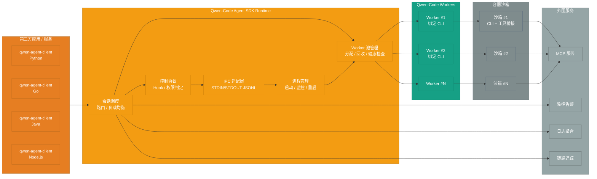

# Qwen-Code Agent 框架架构设计

> **设计版本**: v1.1
> **最后更新**: 2025-10-10

## 设计说明

本文档描述了 Qwen-Code Agent 框架的完整架构设计。

### 重要概念澄清

**核心组件: Qwen-Code Agent SDK**

文档聚焦于 **Qwen-Code Agent SDK** 的设计,它以内嵌运行时的形式为各语言客户端提供统一的会话调度、进程管理与控制协议能力。

- **作用**:
  - 在宿主应用进程内封装会话路由与控制协议
  - 负责 Worker 池的生命周期、健康检查与调度
  - 提供一致的 IPC/JSONL 抽象,屏蔽 CLI 细节
- **形态**: 以 `@qwen-agent/sdk` (Node.js) 与多语言 bindings (Python / Go / Java / Node.js) 发布

核心功能:
- 会话调度与路由
- CLI 子进程生命周期与资源治理
- 控制协议 Hook / 权限判定
- 观察性数据采集 (日志、指标、追踪)

## 完整系统架构



## 系统组成

### 完整组件构成

```
qwen-code-agent-sdk =
    qwen-code-agent-client-sdk (Python/Go/Java/Node)
    + qwen-code-agent-sdk (内部编排层)
    + qwen-code-workers (进程池/实例)
    + sandbox-runtime (容器沙箱)
    + observability-stack (监控 / 日志 / 追踪)
```

## 关键组件说明

### 1. Qwen-Code Agent Client SDK
- **多语言支持**:
  - `qwen-agent-client` (Python)
  - `qwen-agent-client` (Java)
  - `qwen-agent-client` (Go)

- **适用场景**:
  - 第三方后端服务集成
- 希望自定义交互层体验的场景
  - 服务端到服务端调用

- **核心功能**:
  - 同步/异步任务执行
  - 流式输出
  - 会话管理
  - 错误处理与重试

#### 访问模式

- **IPC 模式 (默认)**: SDK 启动本地 `qwen` 子进程,以 JSON Lines 协议进行进程间通信,适合 IDE 插件、企业内网脚本、桌面客户端等同机集成。
- **嵌入式 RPC 模式**: 上层系统可暴露自定义 RPC/HTTP 接口,由宿主进程转发到 SDK,用于集中式部署或多租户管控。

> 📘 IPC 模式的协议与最新 CLI IPC 草案详见《qwen-code-cli-output-format-stream-json-rfc_cn.md》。

**集成方式**:
```python
# 第三方通过 Agent SDK 集成
from qwen_agent_client import QwenAgentClient
client = QwenAgentClient(api_key="...", base_url="...")
result = client.execute(task="...", context={...})
```

### 2. Qwen-Code Agent SDK (内部)

> - IPC 封装: (StdinReader, StdoutWriter, 消息路由)
> - 控制协议:  (ControlProtocolService, Hook Registry)

Qwen-Code Agent SDK 与 Worker 进程之间的通信层。

- **IPC 封装**:
  - 基于 STDIN/STDOUT 的 JSON Lines 协议,输入遵循 `docs/ipc/qwen-chat-request-schema.json`(扩展自 OpenAI `/chat/completions`,包含 `session_id`、`prompt_id`、`tool_call_id` 等会话字段)。
  - CLI 需提供 `--input-format {text,stream-json}` 与 `--output-format {text,stream-json,stream-chunk-json}` 参数,结构化模式自动禁用 TUI,仅 `text` 模式保留原有人机交互。
  - 输出逐行写入 OpenAI 风格的 `chat.completion` / `chat.completion.chunk` 对象;首条响应需携带 `metadata.capabilities`、`metadata.protocol_version`、`output_format` 等握手信息。
  - 事件语义需覆盖 `result/heartbeat`、`result/cancel`、`x-qwen-session-event` 与 `control_request/control_response`,并定义对应的错误对象与回退策略。
  - **当前状态**: qwen-code 仅支持简单的 STDIN 文本读取 (非 JSON Lines)
  - **需要工作**:
    - 新增 `StdinReaderService` (~200 行): 解析结构化请求并保持 `/`、`@`、`?` 命令的即时回执。
    - 新增 `StdoutWriterService` (~150 行): 输出 `chat.completion` / `chat.completion.chunk` JSON Lines,封装错误语义。
    - 改造 `main()` 入口支持握手元数据、事件分发与流式模式 (~100 行)。
    - 扩展 CLI 参数解析,落实完整格式选项及 TUI 自动禁用逻辑。
    - 实现 `result/heartbeat`、`result/cancel`、`x-qwen-session-event`、`control_request/control_response` 的调度骨架。

- **进程管理**:
  - Worker 进程启动、监控、异常重启
  - 进程生命周期管理
  - 资源限制 (CPU/内存/超时)

- **控制协议** :
  - 工具权限动态授予/撤销
  - Hook 回调 (pre-commit、post-execute 等)
  - 会话级配置传递
  - **当前状态**: qwen-code 有 `ApprovalMode` 权限机制,但不支持程序化回调
  - **需要工作**:
    - 新增权限回调接口
    - 新增 Hooks 系统和事件机制
    - 在工具执行流程中插入 Hook 点

### 3. Qwen-Code Workers 进程池
热启动的 CLI 进程池,每个 Worker 独立运行。

**Worker 状态机**:
```
空闲 (Idle)
  ↓ [新会话分配]
占用 (Busy) - 绑定到 session_xxx
  ↓ [会话结束]
空闲 (Idle) - 等待新会话复用
```

**关键特性**:
- **独占机制**:一个 Worker 一次只能服务一个会话,保证会话隔离。
- **会话绑定**:Worker 与会话 ID 绑定,期间不接受其他任务。
- **复用机制**:
  - 会话结束后 Worker **不会自动销毁**
  - Worker 返回空闲池,等待新会话分配
  - 新会话复用现有进程,创建新的会话上下文
  - 大幅减少冷启动时间,提高响应速度

**Worker 复用流程**:
```
1. 会话 A 结束 → Worker #1 状态变为 [空闲]
2. 新会话 B 到达 → 协调器分配 Worker #1
3. Worker #1 状态变为 [占用 - session_B]
4. Worker #1 在同一进程内创建新会话上下文
5. 会话 B 执行完毕 → Worker #1 再次变为 [空闲]
```

**进程池配置**:
- `min_workers`:最小保活 Worker 数量
- `max_workers`:最大 Worker 数量上限
- `idle_timeout`:空闲 Worker 超时回收时间 (默认 30 分钟)
- `max_concurrent_sessions`:单 Worker 生命周期内最大服务会话数

## Worker 复用机制详解

### 为什么需要 Worker 复用?

**问题**:每次新会话启动全新进程会导致:
- 进程冷启动耗时 (3-5 秒)
- 模型加载耗时 (如果涉及本地模型)
- 资源开销大 (频繁创建/销毁进程)

**方案**:Worker 进程复用
- 进程保持运行,会话结束后只清理会话上下文
- 新会话到达时直接在现有进程中创建新会话
- 响应速度提升 **10-20 倍**

### 复用安全性保障

1. **会话隔离**:
   - 每个会话独立的上下文空间
   - 会话结束时清理所有会话变量和状态
   - 下一个会话无法访问上一个会话的数据

2. **资源清理**:
   - 临时文件自动清理
   - 环境变量重置
   - 打开的文件句柄关闭

3. **健康检查**:
   - 定期检测 Worker 内存泄漏
   - 检测僵尸进程或卡死状态
   - 异常 Worker 自动重启

### 复用策略配置

```yaml
worker_pool:
  # 最小保活 Worker 数
  min_workers: 5

  # 最大 Worker 数
  max_workers: 50

  # 空闲 Worker 超时回收 (秒)
  idle_timeout: 1800  # 30 分钟

  # 单个 Worker 最大服务会话数 (防止内存泄漏)
  max_sessions_per_worker: 100

  # Worker 健康检查间隔 (秒)
  health_check_interval: 60
```

## 集成模式

### 模式一: 宿主进程内嵌 SDK

- **适用场景**: IDE 插件、企业内部工具、CLI 扩展等需要最小化依赖的场合。
- **关键特性**:
  - SDK 直接在宿主进程内启动与管理 Worker 池
  - 通过 IPC JSONL 协议与 qwen-code CLI 通信
  - 可同步或流式获取会话输出

**快速上手示例**:
```python
from qwen_agent_sdk import QwenClient

with QwenClient(binary_path="qwen", model="qwen3-coder-plus") as client:
    result = client.chat(
        task="扫描并修复 main.py 中的潜在 bug",
        workspace="/repos/demo"
    )
    print(result.summary)
```

### 模式二: 服务端封装 SDK

- **适用场景**: 需要集中调度或为多语言后端提供统一接口的企业服务。
- **关键特性**:
  - 宿主服务将 SDK 作为内部运行时,对外暴露自定义 RPC/HTTP
  - 可结合企业现有鉴权、审计与配额体系
  - 便于集中化运营、统计与运维

**服务封装伪代码**:
```typescript
import Fastify from 'fastify';
import { createSdkRuntime } from '@qwen-agent/sdk';

const app = Fastify();
const runtime = await createSdkRuntime({
  binaryPath: process.env.QWEN_BIN || 'qwen',
  maxWorkers: 8
});

app.post('/v1/agent/run', async (req, reply) => {
  const { task, workspace } = req.body;
  const session = await runtime.createSession();
  const result = await session.run({ task, workspace });
  return reply.send(result);
});

await app.listen({ port: 6001 });
```

两种模式均通过同一套 SDK API 管理会话、工具权限与上下文,差异主要在于部署形态与对外暴露方式。

## 模块设计概述

### IPC 协议基础

**目标**: 让 qwen-code CLI 支持 JSON Lines IPC 通信

**依赖**: 无

**任务**:
1. 扩展 CLI 参数解析: 支持 `--input-format {text,stream-json}` 与 `--output-format {text,stream-json,stream-chunk-json}`,结构化模式自动禁用 TUI。
2. 实现 `StdinReaderService`: 解析 `qwen-chat-request-schema` 请求,保留 `/`、`@`、`?` 命令即时反馈。
3. 实现 `StdoutWriterService`: 输出携带握手元数据的 `chat.completion` / `chat.completion.chunk` JSON Lines,统一错误语义。
4. 改造 `main()` 入口: 初始化协议握手、分发 `result/*` 与 `control_request/control_response` 事件。
5. 补齐事件流: 实现 `result/heartbeat`、`result/cancel`、`x-qwen-session-event`、`control_request/control_response` 的内部管线。
6. 编写 IPC 协议测试: 覆盖握手、结构化输入、chunk 输出与错误/控制事件。

**可交付成果**:
```bash
echo '{"model":"qwen-coder","messages":[{"role":"user","content":"你好"}],"session_id":"demo-session-1"}' | \
  qwen --input-format stream-json --output-format stream-json

# 预期输出(逐行 JSON Lines)
{"object":"chat.completion","id":"chatcmpl-demo","created":1739430000,"model":"qwen-coder","metadata":{"protocol_version":"1.0","capabilities":{"output_format":"stream-json"}},"choices":[{"index":0,"message":{"role":"assistant","content":"收到,开始处理。"},"finish_reason":"stop"}]}
```
