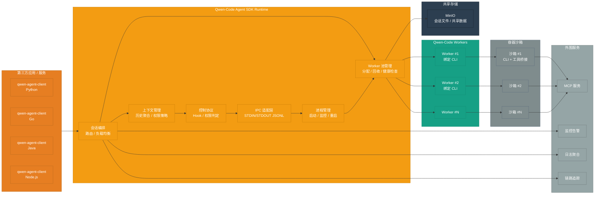
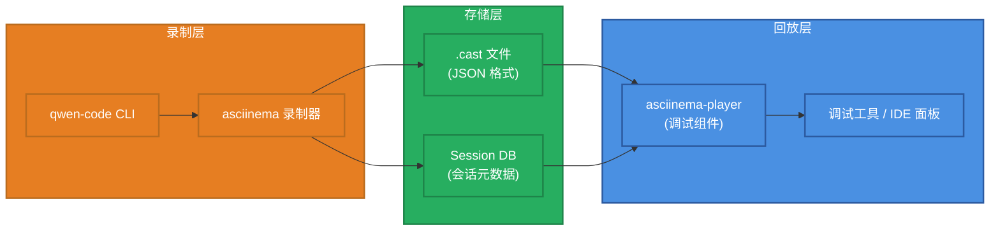

# Qwen-Code Agent 框架架构设计

> **设计版本**: v1.1
> **最后更新**: 2025-10-10

## 设计说明

本文档描述了 Qwen-Code Agent 框架的完整架构设计。

### 重要概念澄清

**核心组件: Qwen-Code Agent SDK**

文档聚焦于 **Qwen-Code Agent SDK** 的设计,它以内嵌运行时的形式为各语言客户端提供统一的会话编排、进程管理与上下文控制能力。

- **作用**:
  - 在宿主应用进程内封装会话路由、上下文管理与控制协议
  - 负责 Worker 池的生命周期、健康检查与调度
  - 提供一致的 IPC/JSONL 抽象,屏蔽 CLI 细节
- **形态**: 以 `@qwen-agent/sdk` (Node.js) 与多语言 bindings (Python / Go / Java / Node.js) 发布

核心功能:
- 会话编排与上下文聚合
- CLI 子进程生命周期与资源治理
- 控制协议 Hook / 权限判定
- 观察性数据采集 (日志、指标、追踪)

## 完整系统架构



## 终端会话回放系统

### 基于 asciinema 的终端回放

为了更好地记录和回放 Agent 的执行过程,框架集成了基于 asciinema 的终端会话回放系统。

#### 核心组件



#### 工作流程

**1. 录制阶段**:
```bash
# Agent SDK 启动 CLI 时自动录制
asciinema rec --stdin --title "Session: session_123" \
  --command "qwen --prompt 'Fix the bug in main.py'" \
  sessions/session_123.cast
```

**2. 存储格式** (.cast 文件):
```json
{
  "version": 2,
  "width": 120,
  "height": 40,
  "timestamp": 1696867200,
  "title": "Session: session_123",
  "env": {
    "SHELL": "/bin/bash",
    "TERM": "xterm-256color"
  }
}
[0.1, "o", "$ qwen --prompt 'Fix the bug in main.py'\n"]
[0.5, "o", "Reading file main.py...\n"]
[1.2, "o", "Found bug on line 42\n"]
[2.0, "o", "Applying fix...\n"]
[2.5, "o", "Done!\n"]
```

**3. 回放集成** (IDE / CLI):
```typescript
// 调试面板中集成 asciinema-player
import { AsciinemaPlayer } from 'asciinema-player';

<AsciinemaPlayer
  src="/api/sessions/session_123/recording"
  cols={120}
  rows={40}
  autoPlay={false}
  speed={1.0}
  controls={true}
  theme="monokai"
/>
```

#### 功能特性

| 功能 | 说明 | 实现方式 |
|------|------|---------|
| **自动录制** | 每个会话自动录制终端输出 | asciinema rec + CLI wrapper |
| **精确回放** | 按时间戳精确还原执行过程 | .cast 文件 + asciinema-player |
| **速度控制** | 支持暂停、快进、倍速播放 | asciinema-player 内置功能 |
| **文本搜索** | 在录制内容中搜索文本 | 本地工具链 (grep / jq) |
| **下载分享** | 导出 .cast 文件或生成分享链接 | 对象存储 / 共享文件夹 |

#### 存储策略

```yaml
recording:
  # 录制配置
  enabled: true                    # 是否启用录制
  auto_start: true                 # 是否自动开始录制

  # 存储配置
  storage_path: ./sessions         # 录制文件存储路径
  max_size_mb: 100                 # 单个录制文件最大大小 (MB)
  retention_days: 30               # 录制文件保留天数

  # 压缩配置
  compress: true                   # 是否压缩旧录制文件
  compress_after_days: 7           # 多少天后压缩
```

#### 隐私和安全

- **敏感信息过滤**: 自动过滤密码、API Key 等敏感输出
- **访问控制**: 只有会话所有者可以访问录制
- **加密存储**: 可选的 .cast 文件加密存储
- **自动清理**: 超过保留期的录制自动删除

#### 使用场景

1. **调试分析**: 回放会话过程,定位问题
2. **操作演示**: 展示 Agent 的工作流程
3. **培训教学**: 用于团队培训和知识分享
4. **审计追踪**: 记录所有操作,满足合规要求

## 系统组成

### 完整组件构成

```
qwen-code-agent-sdk =
    qwen-code-agent-client-sdk (Python/Go/Java/Node)
    + qwen-code-agent-sdk (内部编排层)
    + qwen-code-workers (进程池/实例)
    + sandbox-runtime (容器沙箱)
    + minio-object-storage (共享对象存储)
    + observability-stack (监控 / 日志 / 追踪)
```

## 关键组件说明

### 1. Qwen-Code Agent Client SDK
- **多语言支持**:
  - `qwen-agent-client` (Python)
  - `qwen-agent-client` (Java)
  - `qwen-agent-client` (Go)

- **适用场景**:
  - 第三方后端服务集成
- 希望自定义交互层体验的场景
  - 服务端到服务端调用

- **核心功能**:
  - 同步/异步任务执行
  - 流式输出
  - 会话管理
  - 错误处理与重试

#### 访问模式

- **IPC 模式 (默认)**: SDK 启动本地 `qwen` 子进程,以 JSON Lines 协议进行进程间通信,适合 IDE 插件、企业内网脚本、桌面客户端等同机集成。
- **嵌入式 RPC 模式**: 上层系统可暴露自定义 RPC/HTTP 接口,由宿主进程转发到 SDK,用于集中式部署或多租户管控。

> 📘 IPC 模式的协议与最新 CLI IPC 草案详见《qwen-code-cli-output-format-stream-json-rfc_cn.md》。

**集成方式**:
```python
# 第三方通过 Client SDK 集成
from qwen_agent_client import QwenAgentClient
client = QwenAgentClient(api_key="...", base_url="...")
result = client.execute(task="...", context={...})
```

### 2. Qwen-Code Agent SDK (内部)

> **⚠️ 可行性注意**: 此组件需要大量新增代码
> - IPC 封装: 需约 500 行核心代码 (StdinReader, StdoutWriter, 消息路由)
> - 控制协议: 需约 300 行核心代码 (ControlProtocolService, Hook Registry)
> - 当前 qwen-code 不支持 JSON Lines IPC,需要完整实现

协调器与 Worker 进程之间的通信层。

- **IPC 封装** (⚠️ 需新增约 500 行):
  - 基于 STDIN/STDOUT 的 JSON Lines 协议,输入遵循 `docs/ipc/qwen-chat-request-schema.json`(扩展自 OpenAI `/chat/completions`,包含 `session_id`、`prompt_id`、`tool_call_id` 等会话字段)。
  - CLI 需提供 `--input-format {text,stream-json}` 与 `--output-format {text,stream-json,stream-chunk-json}` 参数,结构化模式自动禁用 TUI,仅 `text` 模式保留原有人机交互。
  - 输出逐行写入 OpenAI 风格的 `chat.completion` / `chat.completion.chunk` 对象;首条响应需携带 `metadata.capabilities`、`metadata.protocol_version`、`output_format` 等握手信息。
  - 事件语义需覆盖 `result/heartbeat`、`result/cancel`、`x-qwen-session-event` 与 `control_request/control_response`,并定义对应的错误对象与回退策略。
  - **当前状态**: qwen-code 仅支持简单的 STDIN 文本读取 (非 JSON Lines)
  - **需要工作**:
    - 新增 `StdinReaderService` (~200 行): 解析结构化请求并保持 `/`、`@`、`?` 命令的即时回执。
    - 新增 `StdoutWriterService` (~150 行): 输出 `chat.completion` / `chat.completion.chunk` JSON Lines,封装错误语义。
    - 改造 `main()` 入口支持握手元数据、事件分发与流式模式 (~100 行)。
    - 扩展 CLI 参数解析,落实完整格式选项及 TUI 自动禁用逻辑。
    - 实现 `result/heartbeat`、`result/cancel`、`x-qwen-session-event`、`control_request/control_response` 的调度骨架。

- **进程管理** (✅ 可行):
  - Worker 进程启动、监控、异常重启
  - 进程生命周期管理
  - 资源限制 (CPU/内存/超时)
  - **当前状态**: Node.js `child_process` 模块完全支持

- **控制协议** (⚠️ 需新增约 300 行):
  - 工具权限动态授予/撤销
  - Hook 回调 (pre-commit、post-execute 等)
  - 会话级配置传递
  - **当前状态**: qwen-code 有 `ApprovalMode` 权限机制,但不支持程序化回调
  - **需要工作**:
    - 新增权限回调接口
    - 新增 Hooks 系统和事件机制
    - 在工具执行流程中插入 Hook 点

### 3. Qwen-Code Workers 进程池
热启动的 CLI 进程池,每个 Worker 独立运行。

**Worker 状态机**:
```
空闲 (Idle)
  ↓ [新会话分配]
占用 (Busy) - 绑定到 session_xxx
  ↓ [会话结束]
空闲 (Idle) - 等待新会话复用
```

**关键特性**:
- **独占机制**:一个 Worker 一次只能服务一个会话,保证会话隔离。
- **会话绑定**:Worker 与会话 ID 绑定,期间不接受其他任务。
- **复用机制**:
  - 会话结束后 Worker **不会自动销毁**
  - Worker 返回空闲池,等待新会话分配
  - 新会话复用现有进程,创建新的会话上下文
  - 大幅减少冷启动时间,提高响应速度

**Worker 复用流程**:
```
1. 会话 A 结束 → Worker #1 状态变为 [空闲]
2. 新会话 B 到达 → 协调器分配 Worker #1
3. Worker #1 状态变为 [占用 - session_B]
4. Worker #1 在同一进程内创建新会话上下文
5. 会话 B 执行完毕 → Worker #1 再次变为 [空闲]
```

**进程池配置**:
- `min_workers`:最小保活 Worker 数量
- `max_workers`:最大 Worker 数量上限
- `idle_timeout`:空闲 Worker 超时回收时间 (默认 30 分钟)
- `max_concurrent_sessions`:单 Worker 生命周期内最大服务会话数

### 4. 容器沙箱
每个 Worker 运行在独立的容器沙箱中,提供安全隔离。

- **qwen-code CLI**:
  - 实际执行任务的 CLI 进程
  - 通过 STDIN 接收指令,STDOUT 输出结果
  - 会话上下文保存在进程内存中

- **工具桥接层**:
  - MCP (Model Context Protocol) 服务集成
  - 文件系统 IO 代理
  - Shell 命令过滤与审计
  - 共享存储挂载:通过 MinIO 客户端或 s3fs 访问对象存储

- **隔离运行时**:
  - `cgroup`:限制 CPU、内存、IO 资源
  - `seccomp`:系统调用白名单,阻止危险操作
  - 网络隔离:可选的网络命名空间隔离

### 5. 外围服务
- **MCP 服务**:Model Context Protocol 外部工具集成。
- **监控告警**:Prometheus 采集指标,Grafana 可视化,实时告警。
- **日志聚合**:ELK 或 Loki 收集所有组件日志,便于问题排查。
- **链路追踪**:Jaeger/Zipkin 追踪请求全链路,定位性能瓶颈。

### 6. MinIO 共享存储
- **统一文件桶**:提供跨机器的对象存储,用于缓存会话文件、上传附件以及第三方任务的输入输出。
- **多端挂载**:SDK Runtime 与 Worker 通过 S3 兼容协议读写,第三方系统可通过 SDK 或挂载点访问同一桶。
- **权限隔离**:支持基于 bucket/prefix 的访问策略,配合 IAM 系统进行细粒度授权。
- **可靠性设计**:支持分布式 MinIO 集群,可启用版本控制与生命周期策略以提升持久化质量。

## Worker 复用机制详解

### 为什么需要 Worker 复用?

**问题**:每次新会话启动全新进程会导致:
- 进程冷启动耗时 (3-5 秒)
- 模型加载耗时 (如果涉及本地模型)
- 资源开销大 (频繁创建/销毁进程)

**方案**:Worker 进程复用
- 进程保持运行,会话结束后只清理会话上下文
- 新会话到达时直接在现有进程中创建新会话
- 响应速度提升 **10-20 倍**

### 复用安全性保障

1. **会话隔离**:
   - 每个会话独立的上下文空间
   - 会话结束时清理所有会话变量和状态
   - 下一个会话无法访问上一个会话的数据

2. **资源清理**:
   - 临时文件自动清理
   - 环境变量重置
   - 打开的文件句柄关闭

3. **健康检查**:
   - 定期检测 Worker 内存泄漏
   - 检测僵尸进程或卡死状态
   - 异常 Worker 自动重启

### 复用策略配置

```yaml
worker_pool:
  # 最小保活 Worker 数
  min_workers: 5

  # 最大 Worker 数
  max_workers: 50

  # 空闲 Worker 超时回收 (秒)
  idle_timeout: 1800  # 30 分钟

  # 单个 Worker 最大服务会话数 (防止内存泄漏)
  max_sessions_per_worker: 100

  # Worker 健康检查间隔 (秒)
  health_check_interval: 60
```

## 集成模式

### 模式一: 宿主进程内嵌 SDK (推荐)

- **适用场景**: IDE 插件、企业内部工具、CLI 扩展等需要最小化依赖的场合。
- **关键特性**:
  - SDK 直接在宿主进程内启动与管理 Worker 池
  - 通过 IPC JSONL 协议与 qwen-code CLI 通信
  - 可同步或流式获取会话输出

**快速上手示例**:
```python
from qwen_agent_sdk import QwenClient

with QwenClient(binary_path="qwen", model="qwen3-coder-plus") as client:
    result = client.chat(
        task="扫描并修复 main.py 中的潜在 bug",
        workspace="/repos/demo"
    )
    print(result.summary)
```

### 模式二: 服务端封装 SDK

- **适用场景**: 需要集中调度或为多语言后端提供统一接口的企业服务。
- **关键特性**:
  - 宿主服务将 SDK 作为内部运行时,对外暴露自定义 RPC/HTTP
  - 可结合企业现有鉴权、审计与配额体系
  - 便于集中化运营、统计与运维

**服务封装伪代码**:
```typescript
import Fastify from 'fastify';
import { createSdkRuntime } from '@qwen-agent/sdk';

const app = Fastify();
const runtime = await createSdkRuntime({
  binaryPath: process.env.QWEN_BIN || 'qwen',
  maxWorkers: 8
});

app.post('/v1/agent/run', async (req, reply) => {
  const { task, workspace } = req.body;
  const session = await runtime.createSession();
  const result = await session.run({ task, workspace });
  return reply.send(result);
});

await app.listen({ port: 6001 });
```

两种模式均通过同一套 SDK API 管理会话、工具权限与上下文,差异主要在于部署形态与对外暴露方式。

## 模块设计概述

### IPC 协议基础

**目标**: 让 qwen-code CLI 支持 JSON Lines IPC 通信

**依赖**: 无

**任务**:
1. 扩展 CLI 参数解析: 支持 `--input-format {text,stream-json}` 与 `--output-format {text,stream-json,stream-chunk-json}`,结构化模式自动禁用 TUI。
2. 实现 `StdinReaderService`: 解析 `qwen-chat-request-schema` 请求,保留 `/`、`@`、`?` 命令即时反馈。
3. 实现 `StdoutWriterService`: 输出携带握手元数据的 `chat.completion` / `chat.completion.chunk` JSON Lines,统一错误语义。
4. 改造 `main()` 入口: 初始化协议握手、分发 `result/*` 与 `control_request/control_response` 事件。
5. 补齐事件流: 实现 `result/heartbeat`、`result/cancel`、`x-qwen-session-event`、`control_request/control_response` 的内部管线。
6. 编写 IPC 协议测试: 覆盖握手、结构化输入、chunk 输出与错误/控制事件。

**可交付成果**:
```bash
echo '{"model":"qwen-coder","messages":[{"role":"user","content":"你好"}],"session_id":"demo-session-1"}' | \
  qwen --input-format stream-json --output-format stream-json

# 预期输出(逐行 JSON Lines)
{"object":"chat.completion","id":"chatcmpl-demo","created":1739430000,"model":"qwen-coder","metadata":{"protocol_version":"1.0","capabilities":{"output_format":"stream-json"}},"choices":[{"index":0,"message":{"role":"assistant","content":"收到,开始处理。"},"finish_reason":"stop"}]}
```

**风险**: 中等 - 需要对 qwen-code 核心流程进行改造

### Python SDK 基础

**目标**: 实现 `qwen-agent-client` Python 包

**依赖**: IPC 协议

**任务**:
1. 实现 `SubprocessCLITransport` (启动 CLI 子进程)
2. 实现消息读写 (JSON Lines)
3. 实现 `QwenClient` (chat 方法)
4. 实现异步支持 (asyncio)
5. 编写基础测试

**可交付成果**:
```python
from qwen_agent_sdk import QwenClient
async with QwenClient() as client:
    response = await client.chat("你好")
```

**风险**: 低 - 依赖 IPC 协议完成

### 控制协议

**目标**: 实现权限回调和 Hooks 系统

**依赖**: IPC 协议

**任务**:
1. 实现 `control_request` / `control_response` 消息
2. 实现权限回调 (`can_use_tool`)
3. 实现 Hooks 系统基础 (`PreToolUse`, `PostToolUse`)
4. SDK 端实现控制协议客户端
5. 在工具执行流程中插入 Hook 点

**可交付成果**:
```python
client = QwenClient(
    can_use_tool=lambda tool, input: user_confirm(tool),
    hooks={'PreToolUse': log_tool_use}
)
```

**风险**: 中等 - 需要改造工具执行流程

### Worker 进程池

**目标**: 实现 Worker 进程池管理

**依赖**: IPC 协议, Python SDK

**任务**:
1. 实现 `QwenWorkerPool` (进程池管理)
2. 实现会话路由
3. 实现健康检查和自动回收
4. 实现进程复用机制

**可交付成果**:
```python
pool = QwenWorkerPool(min_workers=5, max_workers=50)
worker = await pool.acquire()
await worker.execute(session_id, task)
pool.release(worker)
```

**风险**: 低 - Node.js 进程管理成熟

### 其他语言 SDK

**目标**: 实现 Node.js, Go, Java Client SDK

**依赖**: Python SDK

**任务**:
1. 移植 Python SDK 到 Node.js
2. 移植 Python SDK 到 Go
3. 移植 Python SDK 到 Java

**可交付成果**: 多语言 SDK 支持

**风险**: 低 - 移植工作,逻辑已验证

## 可行性总结

### 整体评估

| 设计部分 | 可行性 | 风险 |
|---------|--------|------|
| **IPC 协议** | ⚠️ 可行 | 中等 |
| **Qwen-Code Agent SDK (内部)** | ✅ 完全可行 | 低 |
| **Python SDK** | ✅ 完全可行 | 低 |
| **Worker 进程池** | ✅ 完全可行 | 低 |
| **控制协议** | ⚠️ 部分可行 | 中等 |
| **其他语言 SDK** | ✅ 完全可行 | 低 |
| **SDK MCP 服务器** | 📝 保留设计 | 高 |

### 关键依赖关系

```
IPC 协议
  ├─→ Python SDK
  │     ├─→ Worker 进程池
  │     └─→ Node.js/Go/Java SDK
  └─→ 控制协议

Agent SDK Runtime
  ├─→ Worker 进程池
  └─→ 观察性组件 (监控/日志/追踪)
```

## 实现要点

1. **巩固 IPC 协议能力**:
   - 协议为多语言 SDK 与控制协议提供统一基座
   - CLI 需要完整的握手、结构化输入与错误语义
   - 控制协议和 Worker 池直接复用该事件流

2. **完善 Agent SDK Runtime**:
   - 维护 Worker 复用/回收策略,确保资源占用可控
   - 内置会话上下文聚合与权限裁决 Hook
   - 打通监控/日志/追踪埋点,便于运维观测

3. **模块完成后执行集成验证**:
   - 每个模块完成后进行端到端联调
   - 保证新增能力不会破坏既有行为

4. **保留设计的处理策略**:
   - 接入层形态可按宿主服务需求裁剪
   - SDK MCP 服务器因技术难度较高暂缓

## 参考资料

### 成功案例

- `qwen-code-cli` JSONL IPC prototype
- [Open Interpreter](https://github.com/KillianLucas/open-interpreter) - 多语言 CLI 编排实践

### 可行性评估文档

- `qwen-code-agent-framework-feasibility-audit.md` - 完整可行性稽核报告

### 技术参考

- **asciinema**: 终端录制与回放
- **node-pty**: 子进程终端模拟
- **ws**: WebSocket 实现
- **prom-client** / **winston** / **jaeger-client**: 观察性工具链
